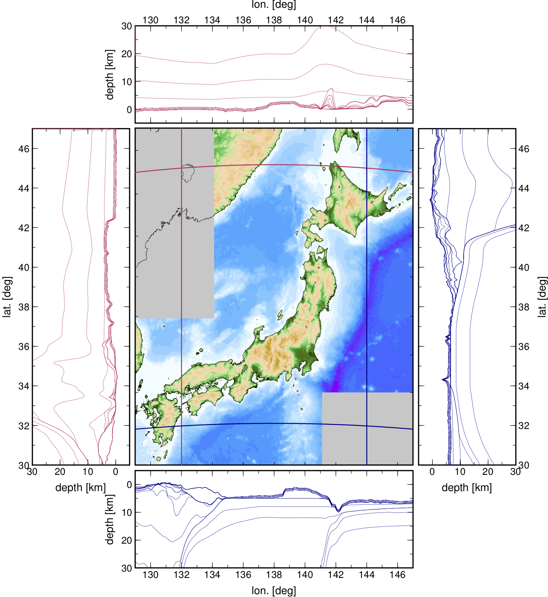

# Preparing the Dataset

## Subsurface Velocity Structure Model

In `OpenSWPC`, a 3D inhomogeneous medium is represented as a set of
velocity discontinuities using `NetCDF`-formatted files. 
As an example of the velocity structure beneath the Japanese
Archipelago, an automatic model generation script for the Japan
Integrated Velocity Structure Model (JIVSM), developed and originally
distributed by the Headquarters for Earthquake Research Promotion in
Japan, is included. An extension of JIVSM (eJIVSM), which covers a wider area, is also provided. These velocity structure models contain the ground surface (topography and bathymetry), subsurface soil, Moho, and oceanic crust of the two subducting plates. To generate these models, the Generic Mapping Tools (GMT) is required. If the user does not use this model, the following steps may not be necessary.

!!! Note "Model area and vertical cross sections of JIVSM/eJIVSM"
    
    Area of JIVSM and eJIVSM. The colored area in the map is where the original JIVSM is defined. eJIVSM is extended to the gray-shaded area via an extrapolation. The surrounding graphs show the depth sections along the lines on the map of the model.


To build this model, first go to  `dataset/vmodel` directory, and then execute the following shell script:
```bash
$ ./gen_JIVSM.sh
```

After a successful execution, 23 `NetCDF`-formatted files will be generated in the two model directories for `JIVSM` and `eJIVSM`. These files can be read and visualized in GMT by the `grdimage` or `grd2xyz` modules. The netcdf filename contains five integer numbers, which correspond to mass density (in kg/m${}^3$), P wavespeed (m/s), S wavespeed (m/s), $Q_P$, and $Q_S$. They indicate the material information below the discontinuity defined in the file. List files of these `NetCDF` files (`jivsm.lst` and `ejivsm.lst`) for use in the `OpenSWPC` will also be generated. 


## Station list

An example script to generate a station list file is stored in `dataset/station/gen_stlst_hinet.sh`. This script generates a formatted list of the high-sensitivity seismograph network Japan (Hi-net) provided by the National Research Institute for Earth Science and Disaster Resilience (NIED). 

To use this script, first download the station csv list from the Hi-net website following the comments in the `gen_stlst_hinet.sh` file. Then, executing this bash script will result in the station list file for `OpenSWPC`.

## On Embedding Parameters

Although most of the behavior of `OpenSWPC` is controlled dynamically by the input parameter file, several parameters are embedded in the source code to achieve high-computational performance, as described below. These parameters are defined in `src/swpc_??/m_global.F90`. If these parameters are modified, re-compilation is necessary. 

!!! Info "Parameters"

    **`UC`**
    : A number to convert the simulation results into the SI unit system. Modifications may be necessary to use a different unit system. The default values are `1e-15` (3D) and `1e-12` (2D).            

    **`MP`**
    : Precision of the finite-difference computation. By default (`MP=DP`), i.e., parts of the computation are performed in double precision, while other unnecessary variables are defined and calculated in single precision to save memory space and computation time. The user may change it to `MP=SP` to switch the entire computation to single precision, which will decrease the required memory up to $2/3$ and allow faster computation speeds. However, in this case, a noisy seismic waveform might be observed, in particular, near the seismic source due to the overflow of floating point numbers.

    **`NM`**
    : Number of generalized Zener viscoelastic bodies. If this number is larger than 1, it represents a nearly frequency-independent constant $Q$ model in a specified frequency range. If this is set to zero, the simulation will be conducted with an elastic body without attenuation. Increasing this number enables the reproduction of a wider frequency range of constant $Q$; however, it may also result in a significant increase in the computational loads for 3D simulations. 

    