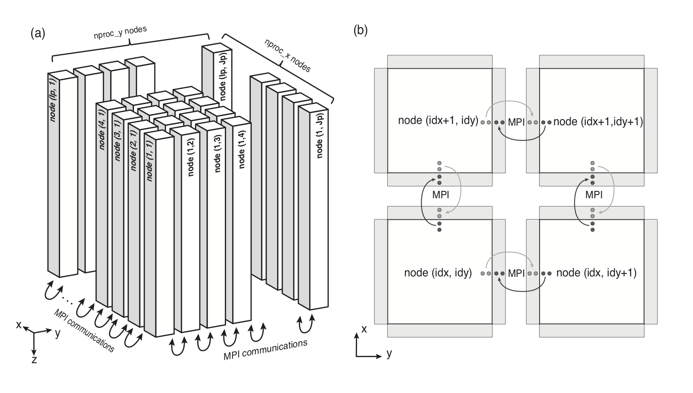
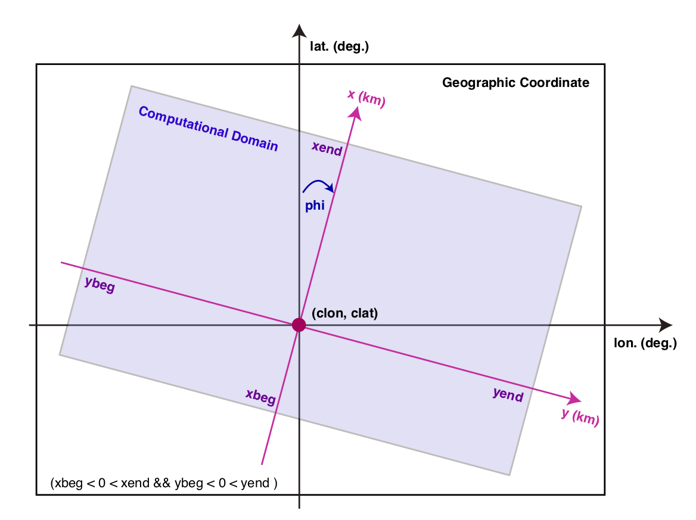
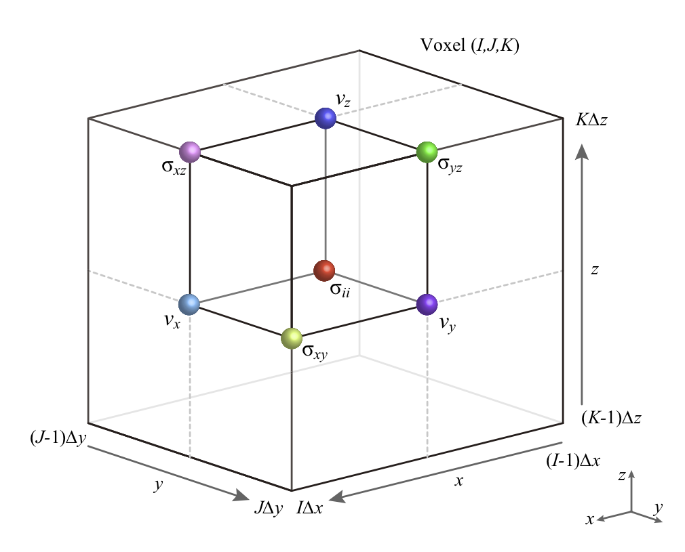

# Coordinates and Parallel Computation

For parallel computation, `OpenSWPC` performs 2D model partitioning for
a 3D code (see figure below) and 1D partitioning for a 2D code, in the
horizontal direction in both cases. The computation is performed in
Cartesian coordinates. We adopt the computational coordinate system
depicted in the Figure. 

!!! Quote "Figure"
    
    (a) Partitioning of the computational domain for MPI. (b) Schematic of the data exchange by the MPI protocol（Modified from Maeda et al., 2013[^Maeda2013]）．

By default, the coordinate axes $x$, $y$, and $z$ represent the north, east, and depth directions, respectively.
They cover the region of `xbeg` $\le x \le$ `xend`, `ybeg` $\le y \le$ `yend`, and `zbeg` $\le z \le$ `zend`. Note that the $z$-axis is defined as positive downward. Because the free surface is usually defined at $z=0$, it is recommended to let `zbeg` be a negative value to include the free surface in the model.

[^Maeda2013]: Maeda, T., Furumura, T., Noguchi, S., Takemura, S., Sakai, S., Shinohara, M., Iwai, K., & Lee, S.-J. (2013). Seismic and tsunami wave propagation of the 2011 Off the Pacific Coast of Tohoku Earthquake as inferred from the tsunami-coupled finite difference simulation, _Bulletin of the Seismological Society of America_, 103, 1456–1472, doi:10.1785/0120120118. [(article link)](https://doi.org/10.1785/0120120118)

The volume is discretized into `nx`, `ny`, and `nz` grids with spatial grid widths of `dx`, `dy`, and `dz`, respectively, in each direction. 
The parameter file must provide definitions of `xbeg`, `ybeg`, and `zbeg` and `nx`, `ny`, and `nz`; other parameters (`xend`, `yend`, and `zend`) are automatically computed from them. 
The center of the Cartesian coordinate ($x = 0$, $y = 0$) corresponds to the center longitude (`clon`) and latitude (`clat`). The geographical coordinate is projected onto the Cartesian coordinate by the Gauss--Krüger transform
as follows (see Figure below):

1.  First generate an evenly spaced grid in Cartesian coordinates from
    the input parameters phi and those related to the x, y coordinates.

2.  Project the grid location onto the geographical coordinate by using
    the Gauss--Krüger transform with a center location of (`clon`,
    `clat`).

3.  Obtain the medium parameter at the grid location via a bicubic
    interpolation of the input velocity structure model.

If the specified area exceeds that of the input velocity model, the
outermost value of the velocity structure is used for the extrapolation.

!!! Quote "Figure"
    
    Relation between computational coordinate and geographical coordinate systems.

[^Kawase2011]: Kawase, K. (2011), A general formula for calculating meridian arc length and its application to coordinate conversion in the Gauss-Krüger projection, _Bulletin of the Geospatial Information Authority of Japan_, _59_, 1–13. [(article link)](http://www.gsi.go.jp/common/000062452.pdf)

## Staggered Grid

`OpenSWPC` adopts the staggered-grid coordinate system shown in the following figure. 

!!! Quote "Figure"
    
    Staggered grid layout in 3D space for the case of `xbeg=ybeg=zbeg=0`

The unit volume shown in the figure is defined as a "voxel" at the grid indices (`I,J,K`). A grid location $x$
belongs to the voxel number

\begin{align}
I = \left \lceil \frac{ x-x_{\text{beg}} }{ \Delta  x } \right \rceil, 
\end{align}

and if the voxel number `I` is given, its center coordinate location is

\begin{align}
x = x_{\text{beg}} + \left( I - \frac{1}{2} \right) \Delta x
\end{align}

where $\lceil \cdot \rceil$ is a ceiling function and $x_{\text{beg}}$
is the minimum value of the $x$-coordinate. Note that $x_{\text{beg}}$
is set to belong to the voxel `I=1`.

 
A voxel has a volume of

\begin{align}
\begin{split}
x_\text{beg} + (I-1)\Delta x < x \le x_\text{beg} +  I \Delta x, 
\\
y_\text{beg} + (J-1)\Delta y < y \le y_\text{beg} + J \Delta y, 
\\
z_\text{beg} + (K-1)\Delta z < z \le z_\text{beg} + K \Delta z 
\end{split}
\end{align}

The normal stress tensor components are defined at the center of the voxel, the shear stress is defined on the edge, and velocity vector components are defined on its surface. 

Medium parameters are defined at the
center of the voxel at

\begin{align}
x_\text{beg} + (I-1/2) \Delta x,
\quad
y_\text{beg} + (J-1/2) \Delta y, \quad
z_\text{beg} + (K-1/2) \Delta z 
\end{align}

If necessary, averaging will be performed
between neighboring voxels.

## Stability and Wavelength Conditions

The spatial grid width, $\Delta x$, $\Delta y$, and $\Delta z$, and the
time step width, $\Delta t$, must satisfy the stability condition. The
stability condition in $N_D$-dimensional space for the order of the
finite difference method $P$ is given by

\begin{align}
  \Delta t < \frac{ 1 }{ V_{\max} } \left( \sum_{i=1}^{N_D} \frac{1}{\Delta x_i^2} \right)^{-1/2} \left( \sum_{p=1}^{P/2} C_p\right) ^{-1}
\end{align}

where $V_{\max}$ is the maximum velocity of the medium, $C_p$ are the
coefficients of the finite difference formula, and $\Delta x_i$ is the
spatial grid width in the $i$-th direction. For the fourth-order formula
of the finite difference method, which is used in the code, the
coefficients are $C_1 = 9/8$ and $C_2 = 1/24$. For example, for the
fourth-order finite difference with isotropic grid sizes
($\Delta x = \Delta y =\Delta z = h$) in three-dimensional space, the
stability condition is reduced to

\begin{align}
  \Delta t < \frac{6}{7} \dfrac{1}{V_{\max} \sqrt{ \dfrac{1}{\Delta x^2} + \dfrac{1}{\Delta y^2} +\dfrac{1}{\Delta z^2}}} = \frac{6 h}{7 \sqrt{3} V_{\max}} \simeq 0.495 \frac{h}{V_{\max}}. 
\end{align}

This condition can be interpreted as **"the distance that the seismic wave
propagates within a single time step must be much smaller than the
spatial grid width."** The numerical simulation will diverge immediately
if this condition is not satisfied.

In addition, **the minimum wavelength of the simulated seismic waves
should be much longer than the spatial grid width**. If the wavelength
becomes relatively small compared to this condition, a fictitious
numerical dispersion will appear and result into inaccurate later
phases. Usually, the wavelength is taken to be longer than 5--10 times
the spatial grid width to avoid this effect. Therefore, the minimum
velocity (usually the S-wave velocity) in the velocity model should be
selected carefully. One may specify a smaller spatial grid size to avoid
this problem; however, in this case, the time-step size must also be
shortened to satisfy the stability condition.

Parameters related to the above conditions will be displayed to the standard error output when the `OpenSWPC` programs start computation as the Stability Condition `c` and the Wavelength Condition `r`. They representes ratios between allowed maximum timestep by the stability condition and the time step parameter `dt`, and between the minimum wavelength in the medium and grid spacing, respectively. The former must be smaller than 1 to perform computation. 

!!! Info "Parameters"
    **`nproc_x`**, **`nproc_y`**
    : Number of partitions in the $x$- and $y$-directions. 
    The total number of partitions will be `nproc_x` $\times$ `nproc_y` for the 3D case and `nproc_x` for the
    2D case. 
    This total number of partitions must be equal to the number of processes given in `mpirun`. 
    These numbers can be 1. 
    If `nproc_x=nproc_y=1`, this will become a serial (non-parallel) computation in practice.

    **`nx`**, **`ny`**, **`nz`**
    : Total number of spatial grids in each direction. `nx` and `ny` do not need to be multiples of `nproc_x` and `nproc_y`, respectively.
    
    **`dx`**, **`dy`**, **`dz`**
    : Spatial grid width in each direction in units of km. The total computational size in the physical domain will be `nx`$\times$`dx`, `ny`$\times$`dy`, and `nz`$\times$`dz`. 
    The grid widths in different directions do not necessarily need to be equal.
    
    `nt` 
    : Number of time steps.
    
    `dt`
    : Length of the time step in seconds. The total physical simulation time will be `nt`$\times$`dt`.
    
    `xbeg`, `ybeg`, `zbeg` 
    : Minimum value of the coordinates. If specifications of `xbeg` or `ybeg` are omitted, they will automatically be set to xbeg = - nx $\times$ dx / 2 and ybeg = - ny $\times$ dy / 2. 
    This setting is recommended to minimize distortion due to the map projection. The default value of `zbeg` is `-30`$\times$`dz`.
    
    `tbeg`
    : Starting time. Usually it is set to zero but can be changed if necessary.
    
    `clon`, `clat`
    : Center longitude and latitude in degrees. The map projection will be
    performed with this location as a reference point.
    
    `phi`
    : Horizontal rotation angle of the computational coordinate (see figure). 
    If `phi`=0, the $x$- and $y$-axes correspond to the north and east directions, respectively. Note that
    the output files (snapshot and waveform) will be rotated if this
    value is nonzero.

