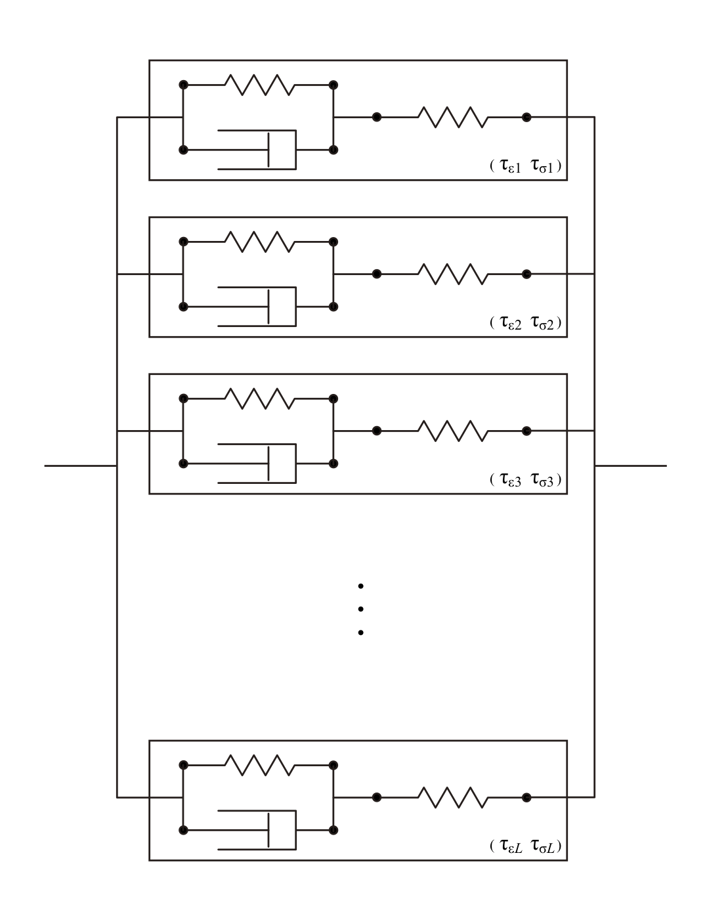
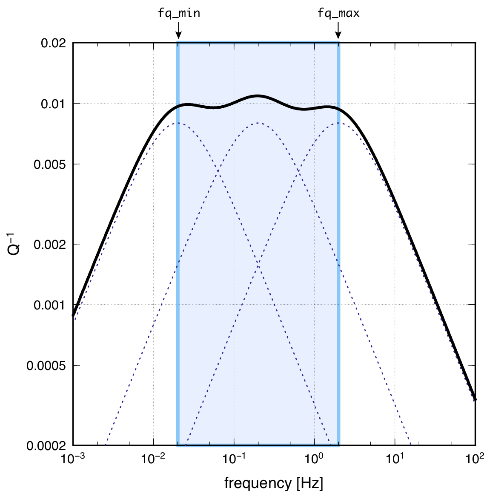

# Viscoelastic Bodies

`OpenSWPC` adopts the generalized Zener body (GZB) as a model of the
viscoelastic body. It consists of several viscoelastic Zener bodies with
different relaxation times to attain nearly constant Q in a wide
frequency range. As a consequence, it accompanies the
frequency-dependent body wavespeed via physical dispersion (e.g., Aki and Richards, 2002[^Aki2002]); therefore, users should specify the reference frequency in which the velocity model is given.

!!! Info "Figure"
    
    A schematic illustration of the Generalized Zener body. Zener Body (boxes) having different chracteristic times are connnected. 

[^Aki2002]: Aki, K., & Richards, P. G. (2002), Quantitative Seismology, 2nd Edition, University Science Books. 

!!! Info "Figure"
    
    Example of frequency dependence of the intrinsic attenuation $Q^{-1}$ for a GZB of `NM=3`. The thick solid line shows the attenuation of the entire model, while the dotted lines show the attenuation model for each constituent of the Zener body. The vertical lines show the specified minimum and maximum frequencies for the constant $Q$ range.

GZB consists of $N_M$ Zener bodies, as schematically shown in the Figure above. This
viscoelastic body is described by the relaxation functions for an
elastic moduli $\pi \equiv \lambda + \mu$ and $\mu$, as

\begin{align}
\begin{split}
    \psi_\pi \left( t \right) 
    &= 
    \pi_R 
    \left( 
      1 - 
      \frac{1}{N_M} 
      \sum_{m=1}^{N_M}
      \left( 1 -\frac{ \tau_m^{\epsilon P}}{\tau_{m}^\sigma} \right)
      e^{-t/\tau^\sigma_m}
    \right)
    H(t)
    \\
    \psi_\mu \left( t \right) 
    &= 
    \mu_R 
    \left( 
      1 - 
      \frac{1}{N_M} 
      \sum_{m=1}^{N_M}
      \left( 1 -\frac{ \tau_m^{\epsilon S}}{\tau^\sigma_m} \right)
      e^{-t/\tau^\sigma_m}
    \right)
    H(t)
\end{split}
\end{align}

where $\tau_m^\sigma$ is the relaxation
time of the $m$-th body, $\pi_R\equiv \lambda_R + 2 \mu_R$ and $\mu_R$
are the relaxed moduli, and $\tau_m^{\varepsilon P}$ and
$\tau_m^{\varepsilon S}$ are creep times of the P- and S-waves,
respectively. The wide frequency range of constant $Q$ is achieved by
connecting Zener bodies with different relaxation times. In addition,
the intrinsic attenuations of the P- and S-waves ($Q_P$ and $Q_S$,
respectively) can be defined independently by choosing different creep
times between the elastic moduli $\pi$ and $\mu$. 

\begin{align}
\begin{split}
    &\dot \sigma_{ii} (t) 
    = 
    \left( \dot \psi_\pi (t)  - 2 \dot \psi_\mu (t)  \right)
    \ast
    \partial_k v_k(t) 
    + 2 \dot \psi_\mu(t)  \ast \partial_i v_i(t) 
  \\
    &\dot\sigma_{ij} (t)
    = 
    \dot \psi_\mu(t) 
    \ast 
    \left( \partial_i v_j(t)  + \partial_j v_i(t)  \right)
\end{split}
\end{align}

The convolution appearing in the
constitutive equation can be avoided by defining the memory variables
 (Robertsson, 1994[^Robertsson1994]) and solving the auxiliary differential equations
for them. We also adopt the $\tau$-method of Blanch (1994[^Blanch1994]) to
automatically choose the creep times that achieve a constant $Q$
condition.

[^Robertsson1994]: 
Robertsson, J. O., J. O. Blanch, and W. W. Symes (1994), Viscoelastic finite-difference modeling, Geophysics, 59(9), 1444–1456, doi:10.1190/1.1443701.

[^Blanch1994]: Blanch, J. O., J. O. Robertsson, and W. W. Symes (1994), Modeling of a constant Q: methodology and algorithm for an efficient and optimally inexpensive viscoelastic technique, Geophysics, 60, 176–184, doi:10.1111/j.1365-246X.2004.02300.x.

!!! Info "Parameters"    

    **`fq_min` **
    : Minimum frequency of the constant-$Q$ model.

    **`fq_max` **
    : Maximum frequency of the constant-$Q$ model.
    
    **`fq_ref`  **
    : Reference frequency at which the velocity model is given.

The $Q^{-1}$ value becomes nearly constant between the frequencies of
`fq_min` and `fq_max`. 
Outside of the band, the attenuation becomes weaker with increasing/decreasing
frequency. As shown in this figure, the nearly constant $Q^{-1}$ is
achieved using three different viscoelastic bodies. If one needs to make
$Q^{-1}$ constant over a wider frequency range, the hard-coded parameter
`NM` should be increased. However, this leads to a significant increase
in the memory usage and computational loads. The frequency dependence of
$Q^{-1}$ with the parameters specified above can be investigated using
the program `qmodel_tau.x`.

Note that velocities of P and S waves depends on a frequency if one use constant-$Q$ model at a wide frequency band. 
A parameter `fq_ref` is used as a reference frequency at which the input velocities are defined. 