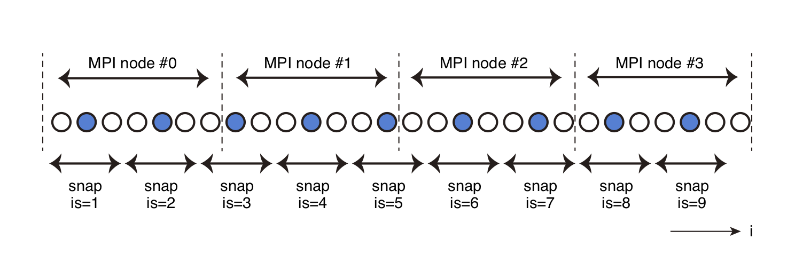

# Simulation Data Output

## Output Datafile Format

`OpenSWPC` can export two types of data: spatiotemporal snapshots and
the seismic waveform at stations.

For snapshot files, the user may choose from an originally defined
binary format (obsolete and not recommended) or a `NetCDF` file (recommended). The waveforms are
usually exported in `SAC` format. The endian conversion is not performed
at the time of the data output. However, the official libraries of
`NetCDF` and `SAC` automatically detect the endian format and convert
them if necessary. Therefore, users do not have to worry about the
differences in endian formats between machines.

There is a utility program to read the original-formatted data. Note
that the binary format may have slight differences for different
versions of `OpenSWPC`. Because the format change is tracked, backward
compatibility is always assured. It is recommended to use the same
version of the simulation code. 

### Header information of the waveform files

For `SAC` files, the header components
described in the following table are automatically set. The units of `SAC` files
are nm/s for velocity and nm for displacement, following the standard of
`SAC`. While the earthquake source may be represented by multiple point
sources, the header always represents the source listed in the first
line of the source input file.

| header name               | description                                                                                                                                                                                  |
| ------------------------- | -------------------------------------------------------------------------------------------------------------------------------------------------------------------------------------------- |
| `kevnm`                   | `title` of the parameter file                                                                                                                                                                |
| `evlo`, `evla`, `evdp`    | The location of the event (in degrees for horizontal, in m for depth)．If the loctaion is given in the Cartesian coordinate, a map projection is perfomed with parameters `clon` and `clat`. |
| `o`                       | Origin time of the event listed in the first line of the source list                                                                                                                         |
| `kzdate`, `kztime`        | Date and time of the execution of the simulation code                                                                                                                                        |
| `b`                       | `tbeg` of the parameter file                                                                                                                                                                 |
| `delta`                   | `ntdec_w` $\times$ `dt`                                                                                                                                                                      |
| `mag`                     | The moment magnitude converted from the seismic moment                                                                                                                                       |
| `user0`,..., `user5`      | Moment tensor ($m_{xx},m_{yy},m_{zz},m_{yz},m_{xz},m_{xy}$) of the first line of the source file                                                                                             |
| `user6`, `user7`, `user8` | `clon, clat, phi` of the parameter file                                                                                                                                                      |
| `kstnm`                   | `stnm` of the parameter file                                                                                                                                                                 |
| `stlo`, `stla`, `stdp`    | Station location (in degrees for horizontal, in m for depth). If the loctaion is given in the Cartesian coordinate, a map projection is perfomed with parameters `clon` and `clat`.          |  |
| `kcmpnm`                  | `Vx, Vy, Vz` for velocities or `Ux, Uy, Uz` for displacements                                                                                                                                |
| `cmpinc`,`cmpaz`          | Station directions according to the coordinate specification                                                                                                                                 |
| `idep`                    | 7 for velocity, ６ for displacement                                                                                                                                                          |

### Header of the Snapshot
The snapshot file contains the header information listed in the following table. These headers are commonly defined in either original format or `NetCDF`. 

| var name     | type          | description                                                       |
| ------------ | ------------- | ----------------------------------------------------------------- |
| `bintype`    | character(8)  | Fixed to "STREAMIO"                                               |
| `codetype`   | character(8)  | `SWPC_3D`, `SWPC_PV`, or `SWPC_SH` depending on the code          |
| `hdrver`     | integer       | Header version                                                    |
| `title`      | character(80) | `title` in the parameter file                                     |
| `exedate`    | integer       | Date and time of the execution in POSIX time                      |
| `coordinate` | character(2)  | Snapshot cross section: `'xy'`, `'xz'`, `'yz'`, `'fs'`, or `'ob'` |
| `datatype`   | character(2)  | Data type: `'ps'` or `'v2'` or `'v3'`                             |
| `ns1,ns2`    | integer       | Number of data samples along the first and second axes            |
| `beg1,beg2`  | real          | Coordinate value at the first data point of the axes              |
| `ds1,ds2`    | real          | Snapshot grid spacing                                             |
| `dt`         | real          | Time step width of the snapshot                                   |
| `na1,na2`    | real          | Grid numbers of the absorbing boundary layer in the snapshot      |
| `nmed`       | integer       | Number of stored medium parameters                                |
| `nsnp`       | integer       | Number of snapshots per time step                                 |
| `clon,clat`  | real          | `clon, clat` in the parameter file                                |
| `v1,v2,v3`   | real          | Currently not being used                                          |

!!! Caution "Change in a SAC header"
    `evdp` is measured in a unit of km after OpenSWPC version 5.0, while it was in m unit previously.

For `NetCDF`, these headers are set as global attributes. The other
headers are set following the [COARDS Conventions](https://ferret.pmel.noaa.gov/Ferret/documentation/coards-netcdf-conventions) and the [CF
Convention](http://cfconventions.org). Thanks to these rules, output `NetCDF` files of `OpenSWPC` can be directly read by many scientific visualization tools, such as ParaView, Panoply or GMT. 

## Snapshot Data Output

Spatiotemporal snapshot output may be created along cross sections of
`xy`, `yz`, and `xz` profiles on the topography (`fs`) and/or on the
bathymetry (`ob`). There are three types of snapshots: divergence and
rotation of the velocity (`ps`), velocity (`v`), and displacement (`u`).

The use of spatial and temporal decimations is recommended to reduce the
I/O load and export data size. Decimation in time is specified by
`ntdec_s` starting from `it=0` (before starting the computation). In
space, the decimations are performed by factors of `idec`, `jdec`, and
`kdec`, and `OpenSWPC` tries to export the center of the decimation
window, as schematically shown in the following figure. 
The numbers of exporting grids in each MPI
node do not necessarily need to be the same for each node. The
amplitudes of these snapshot points will be gathered to specific nodes and exported as single files.

!!! Info "Figure"
    
    Schematic of the spatial decimation for the snapshot output. The vertical dotted lines show the borders of the MPI nodes. In this example, the data at the blue grids will be exported as the snapshot data.

The snapshot data will be exported from different node of computation to ballance the computational loads. 

| section | type | output node      |
| ------- | ---- | ---------------- |
| yz      | PS   | $0$              |
| xz      | PS   | `mod(1, nproc)`  |
| xy      | PS   | `mod(2, nproc)`  |
| fs      | PS   | `mod(3, nproc)`  |
| ob      | PS   | `mod(4, nproc)`  |
| yz      | V    | `mod(5, nproc)`  |
| xz      | V    | `mod(6, nproc)`  |
| xy      | V    | `mod(7, nproc)`  |
| fs      | V    | `mod(8, nproc)`  |
| ob      | V    | `mod(9, nproc)`  |
| yz      | U    | `mod(10, nproc)` |
| xz      | U    | `mod(11, nproc)` |
| xy      | U    | `mod(12, nproc)` |
| fs      | U    | `mod(13, nproc)` |
| ob      | U    | `mod(14, nproc)` |

!!! Info "Parameters"

    **`snp_format`**
    : Datafile format of the snapshot files: `"native"` (original binary
    format; obsolete) or `"netcdf"` (recommended). Although the `NetCDF` file format is
    recommended for convenience in data handling, the use of this format
    may lead to a slight ($\sim$ 10 %) increase in computation time.
     
    **`xy_ps%sw`, `xz_ps%sw`, `yz_ps%sw`, `fs_ps%sw`, `ob_ps%sw` **
    : Flags for exporting snapshot files of the PS files (`.true.` or
    `.false.`). If they are set to `.true.`, the divergence and rotation
    vector of the particle velocity will be exported.                                                     
    
    **`xy_v3%sw`, `xz_v3%sw`, `yz_v3%sw`, `fs_v3%sw`, `ob_v3%sw`**
    :  Flags for exporting snapshot files of the velocities.                                                                                          
    **`xy_u3%sw`, `xz_u3%sw`, `yz_u3%sw`, `fs_u3%sw`, `ob_u3%sw`**
    : Flags for exporting snapshot files of the displacements.
    
    **`z0_xy`**
    : Depth (km) of the snapshot cross section.
    
    **`x0_yz`**
    : X-coordinate value (km) of the snapshot cross section.
    
    **`y0_xz`**
    : Y-coordinate value (km) of the snapshot cross section.
    
    **`ntdec_s`**
    : Temporal decimation factor of the snapshot output. Snapshots will be
    exported every `ntdec_s` time steps.

    **`idec`, `jdec`, `kdec`**
    : Spatial decimation factor of the snapshot output for the $x$, $y$,
    and $z$ directions.

## Seismic Waveform Output

Seismic velocity and/or displacement records at specified stations can
be obtained as SAC-formatted files by setting the parameters `sw_wav_v`
and/or `sw_wav_u` to `.true.`. Displacement records are calculated
before the decimation, and therefore, they are expected to be more
accurate than performing a numerical integration of the output velocity
records. The traces are stored in the memory during the computation and
are exported at the end.

Station locations are given in Cartesian coordinates (`xy`) or
geographical coordinates (`ll`), as in the following table. 
In the station list, lines starting with `#` will be ignored.

| Type   | Format                        |
| ------ | ----------------------------- |
| `'xy'` | `x      y     z   name   zsw` |
| `'ll'` | `lon    lat   z   name   zsw` |

The depth of the station can be changed depending on the variable `zsw` in
the station list, as shown in the next table. T

| `zsw`                    | Station depth setting                                                |
| ------------------------ | -------------------------------------------------------------------- |
| `’dep’`                  | Calculate the station location from the given station depth          |
| `’fsb’`                  | One grid below the free surface (for oceanic areas, the sea surface) |
| `’obb’`                  | One grid below the ocean bottom (seafloor) or ground surface         |
| `’oba’`                  | One grid above of the ocean bottom (seafloor) or ground surface      |
| `’bdi’ (i=0, \cdots, 9)` | Internal velocity discontinuity specified by the velocity model      |

This operation is important because the
station near the free surface is occasionally located above the
approximated ground surface in air due to the staircase approximation of
the topography and bathymetry. Usually, it is recommended to set
`zsw=’obb’`; this setting locates stations one-grid level below the
ground surface (or seafloor).

Multiple stations can be specified in the station list file. There is no
fixed limit on the number of stations. The number of stations is
automatically counted, and only the stations inside the computational
region will be exported.

!!! Info "Parameters"

    **`sw_wav_v`**, **`sw_wav_u`**
    : `.true. for exporting velocity (`sw_wav_v`) and displacement (`sw_wav_v`) traces.
    
    **`ntdec_w`**
    : Decimation factor of the waveform output. For `ntdec_w=1`, traces at
    every computational time step will be exported.
    
    **`st_format`**
    :Format of the station list file. See the above table. 

    **`fn_stloc`**
    : Station location filename.
    
    **`wav_format`**
    : Station file format: `’sac’` (usual, recommended) or `’csf’`.

### Strain and stress output

By specifying `sw_wav_strain = .true.` and `sw_wav_stress = .true.`, users can obtain strain and stress time series as a SAC-formatted data file as in the case of velocity and displacement (**Experimental; new in version 5.0**). The specification of station locations are same with the case of velocity/displacement. The output units are nondimensional for strain and \[Pa\] for stress data. 

### Distance calculation mode
In default, `OpenSWPC` will store the station location via `stlo` and `stla` headers of `SAC`, and `SAC` program will automatically calculate the epicentral distance. However if the input station location is given in `xy` coordinate and distance if very long, the error originated from the map projection is not negilible. In such cases, one may calculate epicentral distance in the `OpenSWPC` and store to the `epdist` header of `SAC` files, and prohibit `SAC` to overwright the distance header. 

!!! Info "Parameters"
    **`wav_calc_dist`**
    : If this parameter is `.true.`, calculate and store the epicentral distance and store it to the `SAC` header. 

### The csf format

Because the `SAC` format is defined to express the data at one component
of one station in a single file, the number of files may become
extraordinarily large. In this case, data transfer between computers
will become very inefficient. For `OpenSWPC` version 3.0 or later, users
can choose a concatenated `SAC` format (csf) for the data output by
specifying `wav_format=’csf’`. This is a set of `SAC` binary files
connected to a single file, with headers as in the following: 

!!! Info "CSF header format"
    **`identifier`**
    : Fixed to 'CSFD'

    **`ntrace`**
    : Number of traces in the file
    
    **`npts`**
    : Number of samples in a trace

It is assumed that the number of samples (`ntpts`) are in common in the `csf` format. If the `csf` format is selected, each parallel computation node exports waveforms in the corresponding domain into csf files for every components. 

!!! Caution "Exporting large number of waveform dataset"
    Large-scale computer systems often adopt the parallel lustre file system, which is *not* good at treating small but many files such as seismic wave traces in SAC format. In this case, it is recommended to use concatnated CSF format.

## Output Filename Conventions

Output data names are determined by the following rules:

-   Snapshot     `(odir)/(title).(section).(type).(ext)`
-   Waveform (SAC)    `(odir)/wav/(title).(stnm).(component).sac`
-   Waveform (CSF)    `(odir)/wav/(title).(node-ID).(component).csf`
-   Computation time   `(odir)/wav/(title).tim`

In the above rules, (section) takes a cross section such as `xy` or
`yz`. (type) takes v or ps depending on the snapshot data type.
(component) takes `Vx`, `Vy`, or `Vz` for the velocity or `Ux`, `Uy`, or `Uz` for
the displacement. Extension of the snapshot `ext` will be `nc` for NetCDF and `snp` for the native format. 
