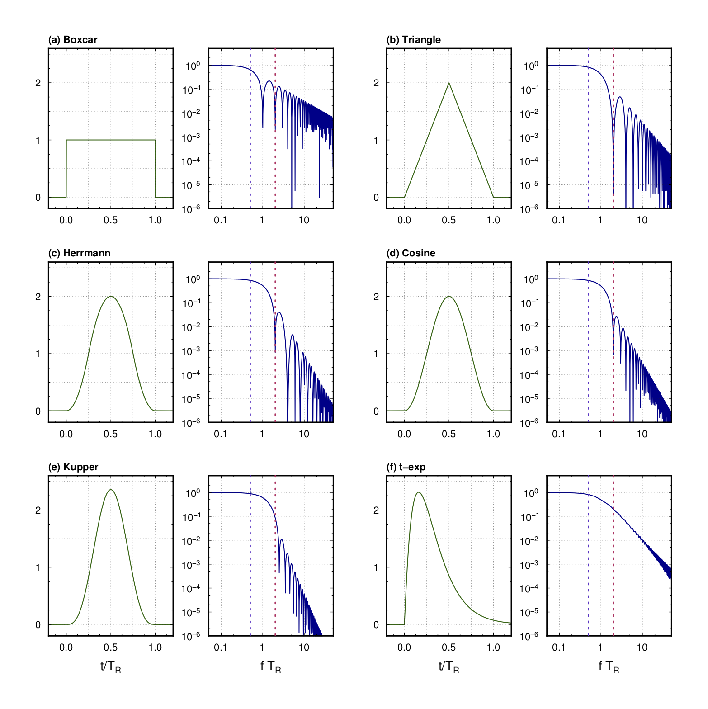
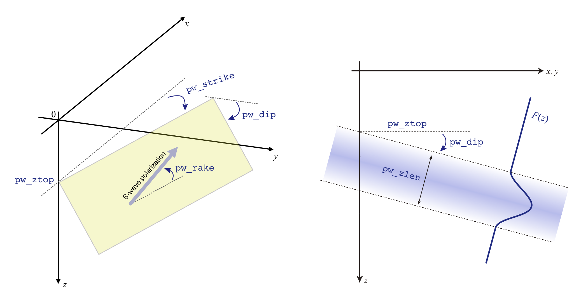
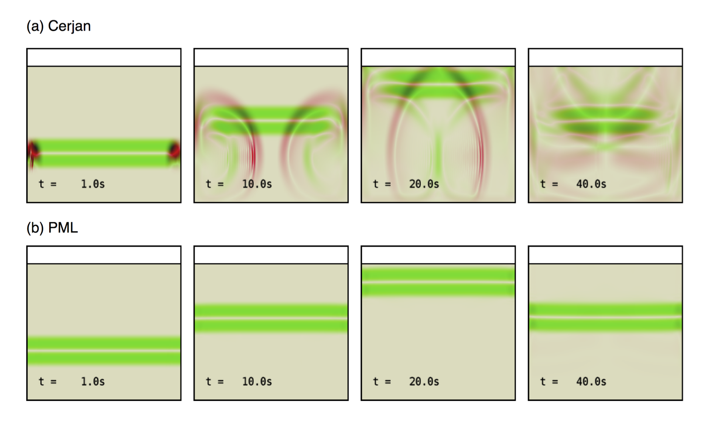

# 震源の指定

## モーメント時間関数

ここでは本コードで利用可能なモーメント時間関数（震源時間関数）$\dot{M}(t)$とそのスペクトルを整理する．以下のモーメント時間関数は，すべて継続時間（もしくは特徴的時間）$T_R$をもち，総モーメントが$1$に規格化されている．

`OpenSWPC`では，パラメタ `stftype`の選択により，以下の震源時間関数が選択できる．

- Box-car function (`boxcar`)

\begin{align}
   \dot{m}^ R \left(t\right) &=
    \frac{1}{T_R} 
  & \begin{array}{r} ( 0 \le t \le T_R) \\ \end{array}
\end{align}

- Triangle function (`triangle`)

\begin{align}
\dot{m}^ T \left(t\right)  = 
\begin{cases}
4t/T_R^2 & ( 0 \le t \le T_R/2 ) \\
-4(t-T_R)/T_R^2 & ( T_R/2 < t \le T_R )
\end{cases}
\end{align}
 
- Herrmann function (`herrmann`)

\begin{align}
\dot{m}^ H \left(t\right) =
\begin{cases}
16 t^2 / T_R^3 & ( 0 \le t \le T_R/4  ) \\
-2 ( 8 t^2 - 8 t T_R + T_R^2 ) / T_R^3  & ( T_R/4 < t \le 3T_R/4  ) \\
16 \left( t - T_R \right)^2 / T_R^3 &  (3T_R/4 < t \le T_R  )
\end{cases}
\end{align}

- Cosine function (`cosine`)

\begin{align}
\dot{m}^ C \left(t\right) =
\frac{1}{T_R} \left[ 1 - \cos \left(\frac{2 \pi t}{T_R} \right) \right]
\quad ( 0 \le t \le T_R) 
\end{align}

- Küpper wavelet (`kupper`)

\begin{align}
  \dot{m}^K \left( t \right ) &= 
  \frac{3 \pi}{4 T_R} \sin^3\left( \frac{\pi t}{T_R} \right) 
  \quad ( 0 \le t \le T_R) 
\end{align}

- t-exp type function (`texp`)

\begin{align}
  \dot{m}^{E} \left( t \right) &= \frac{(2 \pi)^2 t}{T_R^2} \exp\left[ - \frac{ 2 \pi t}{T_R}\right]
  \quad ( 0 \le t ) 
\end{align}

それぞれの震源時間関数形状とその振幅スペクトルを下図に示す．

!!! Quote "震源時間関数"
    
    震源時間関数 $\dot{m}(t)$（左）とその振幅スペクトル（右）．

モーメント時間関数のスペクトルは，$f\gg 1/T_R$ の条件下で，それぞれ $f^{-1}$ から $f^{-4}$ のロールオフを持つ．
シミュレーションが数値分散を起こさないためには，対象周波数帯の上限で充分に震源のスペクトルが小さくなっている必要がある．
そのような条件を満たす最大周波数として，ここでは$f_\text{max}=2/T_R$（図中赤点線）を採用する．
この$f_\text{max}$以下の周波数では分散を起こさないようにモデルパラメタが設定されていればよい．
一方，スペクトルの応答がほぼ一定になる，つまり震源時間関数がデルタ関数と見なせるのは概ね$f \le 1/(2 T_R)$（図中青点線）である．

## モーメントテンソル震源

震源メカニズムは6成分のモーメントテンソル，もしくはダブルカップル震源を特徴付ける`strike`,
`dip`,
`rake`の3つの角度で与えられる．また，震源位置を計算座標系もしくは地理座標系でも与えられる．さらに，震源の大きさを表す方法に地震モーメント$M_0$，モーメントマグニチュード$M_W$，すべり量$D$と断層面積$S$の3通りがある．これらの組み合わせにより，あわせて10種類の震源メカニズムフォーマットがある．

震源はモーメント時間関数を用いて応力降下として与えられる．要素モーメント時間関数は上述の6種類から選び，関数名をパラメタとして与える．どの関数であっても，震源の破壊開始時間$T_0$と継続時間$T_R$，ならびに全モーメント（モーメント時間関数の時間積分値）$M_0$がパラメタとして与えられる．

`OpenSWPC`は複数の点震源を用いることができる．震源ファイルに複数行の震源要素があれば，それらすべての要素（のうち計算モデル領域内にある点）から地震動を放射させる．震源位置と破壊開始時刻等を少しずつずらすことにより，擬似的に有限断層面からの破壊を再現することも可能である．
なお，震源ファイルは，そのフォーマットに関わらずすべて`#`から始まる行はコメント行と見なされる．

特殊な条件として，パラメタ`sdep_fit`により，震源位置を速度構造モデルのプレート境界上に置くことが可能である．この場合は，震源ファイルの深さ指定は無視される．この場合，構造モデルの指定で該当する番号の層が指定されていることが必要である．

!!! Info "Parameters"
    **`stf_format`**
    : モーメントテンソルの表現の種別．以下10種類から選ぶ．

        -  `'xym0ij'` :  $x$, $y$, $z$, $T_0$, $T_R$, $M_0$, $m_{xx}$, $m_{yy}$,  $m_{zz}$,  $m_{yz}$, $m_{xz}$, $m_{xy}$    
  
        -  `'xym0dc'`  :  $x$, $y$, $z$, $T_0$, $T_R$, $M_0$,  strike, dip, rake  

        -  `'llm0ij'`   : lon, lat, $z$, $T_0$, $T_R$, $M_0$, $m_{xx}$, $m_{yy}$,  $m_{zz}$, $m_{yz}$, $m_{xz}$, $m_{xy}$  

        - `'llm0dc'`  :  lon, lat, $z$, $T_0$, $T_R$, $M_0$, strike, dip, rake  

        - `'xymwij'`   :  $x$, $y$, $z$, $T_0$, $T_R$, $M_W$,  $m_{xx}$, $m_{yy}$, $m_{zz}$, $m_{yz}$, $m_{xz}$, $m_{xy}$  

        - `'xymwdc'` :  $x$, $y$, $z$, $T_0$, $T_R$, $M_W$, strike, dip, rake  

        - `'llmwij'`  : lon, lat, $z$, $T_0$, $T_R$, $M_W$, $m_{xx}$, $m_{yy}$, $m_{zz}$, $m_{yz}$,  $m_{xz}$,  $m_{xy}$  

        - `'llmwdc'`  : lon, lat, $z$, $T_0$, $T_R$, $M_W$, strike, dip, rake
       
        - `'lldsdc'` : lon, lat, $z$, $T_0$, $T_R$, $D$, $S$, strike, dip, rake
  
        - `'xydsdc'` : $x$, $y$, $z$, $T_0$, $T_R$, $D$, $S$, strike, dip, rake

        - `'psmeca'` : lon, lat, $z$, $M_{rr}$, $M_{tt}$, $M_{ff}$, $M_{rt}$, $M_{rf}$, $M_{tf}$, iexp &nbsp; **(new in v5.2)**
       

        それぞれの量の単位は，$x$, $y$, $z$は[km]，$M_0$ と$m_{ij}$ は [Nm], $T_0$, $T_R$は [s], 角度変数はすべて [degree]，すべり量$D$は [m]，面積$S$は[m${}^2$]がそれぞれ仮定されている．
    
    ** `stftype`**
    : 要素震源時間関数（モーメント時間関数）の種類．`'boxcar'`（箱形関数）, `'triangle'`（三角形）, `'herrmann'`（Herrmann関数）,`'kupper'`（Kupper wavelet）, `'cosine'` （$\cos$関数）, `'texp'`（$t \exp$関数）から選択する．

    ** `fn_stf`**
    : 震源情報ファイル．このファイル中に`stf_format`で指定された書式で震源情報を記載する．
 

    ** `sdep_fit` **
    : 震源の深さを強制的に境界に合わせるかどうかの指定． `'asis'`: なにもしない（デフォルト）`'bd{i}'` (i=1,2,$\cdots$9): `i`番目の境界に合わせる．

### 地震の大きさの指定

モーメントテンソル成分を直接与える場合には，地震モーメント$M_0$あるいはモーメントマグニチュード$M_W$の指定と，モーメントテンソル成分のあいだに，大きさに関するトレードオフがある．たとえば，以下の2つの指定は完全に等価である：

| $M_0$ || $m_{xx}$ | $m_{yy}$ | $m_{zz}$ | $m_{yz}$ | $m_{xz}$ | $m_{xy}$ |
| -- || -- | -- | -- | -- | -- | -- |
| `1e15` || `1.0` | `1.0` | `1.0` | `0.0` | `0.0` | `0.0` | 
| `1.0` || `1e15` | `1e15` | `1e15` | `0.0` | `0.0` | `0.0` | 

入力されたパラメタに基づき，最終的な地震モーメント$\overline{M}_0$は，

$$
    \overline{M}_0 =\times \frac{ M_0 }{\sqrt{2}} \sqrt{m_{xx}^2 +m_{yy}^2 +m_{zz}^2 + 2(m_{yz}^2+m_{xz}^2+m_{xy}^2)}
$$

により定まる．もし複数の点震源が指定される場合には上式のすべての天震源要素についての和が全地震モーメントとなる．2次元P-SV, SH計算の場合には，それぞれの断面で有効な成分のみが評価される．このように大きさが分離できる記法を採用しているため，通常はモーメントテンソル成分は

$$
 \sqrt{m_{xx}^2 +m_{yy}^2 +m_{zz}^2 + 2(m_{yz}^2+m_{xz}^2+m_{xy}^2)} = 1
$$

と規格化されていることが暗に期待されている．かならずしもそうする必要はないが，この規格化がされていないと，パラメタとして入力した$M_W$や$M_0$と実際に計算される地震の大きさが異なる可能性がある．

### `psmeca` 指定

[GMT](https://www.generic-mapping-tools.org/) の`psmeca -Sm` や[globalcmt](https://www.globalcmt.org/CMTsearch.html)で標準的に使われているフォーマットで震源を指定する．指定されるのは震源の緯度経度深さならびに極座標系におけるモーメントテンソル（$M_{rr}$, $M_{tt}$, $M_{ff}$, $M_{rt}$, $M_{rf}$, $M_{tf}$ の順）と地震モーメントの指数部（整数）である．指数部は慣例に従い dyn-cm 単位で与えられることに注意されたい．これらのパラメタがOpenSWPC内部で直交座標系におけるモーメントテンソルに変換されて計算に用いられる．震源における破壊開始時間$T_0$は$0$，ライズタイム$T_R$は Ekström et al. (2012)[^Ekström2012] に基づき，スケーリング

$$
 T_R = 2 \times 1.05 \times 10^{-8} \times M_0^{1/3}
$$ 

によって定める．ただしここでも$M_0$はdyn-cm単位の値である．

なお，本指定は version 5.2 から有効となる．

!!! Warning "水平回転に関する注意"
    Version 5.2 現在，パラメタ `phi`$\neq0$のとき，震源メカニズムを strike, dip, rake で与えたときとモーメントテンソルで与えたときで，メカニズムの回転の挙動が異なる．

    前者 strike, dip, rake で与えたときには，`phi` の値に関わらず strike は北から測ったものとして計算される．一方，モーメントテンソルはあくまでも回転後の$x$, $y$座標に対して定義されていることが仮定される．つまり，カタログからモーメントテンソル成分を利用し，かつ座標系を水平回転して計算するときには，ユーザーがモーメントテンソルの回転計算を自ら行ってパラメタとして与えなければならない．

    これらの挙動が系統的でないことは開発者も認識しており，将来のバージョンで挙動が変更される可能性がある．

## 実体力モード

モーメントテンソル震源に代わり，実体力を震源とすることもできる．
この場合，$m_{ij}$のかわりに$f_x$, $f_y$, $f_z$の力源を直接指定する．
実体力はモーメントテンソル震源と同様のベル型の震源時間関数を用いて計算される．
任意個の点震源を記述することができるが，
モーメントテンソルによる震源と実体力による震源からの同時輻射は，一度の実行では計算できない．

!!! Info "Parameters"
    **`bf_mode`**
    :   実体波モードのON/OFFを設定する．`.true.`でONになる．

    **`stf_format`**
    :  震源ファイルのフォーマット（下記参照）．モーメントテンソル震源とは記法が異なるので注意．

        -  `'xy'`:    x,    y,     z,   $T_0$ ,  $T_R$ ,  $f_x$,   $f_y$,   $f_z$
        
        -  `'ll'`:   lon,    lat ,  z,   $T_0$,   $T_R$ ,  $f_x$,   $f_y$ ,  $f_z$

    **`stftype`**
    : 要素震源時間関数（モーメント時間関数）の種類．指定法はモーメントテンソル震源に同じ．

    **`fn_stf`**
    : 震源情報ファイル．モーメントテンソルとは記法が異なるので注意．

    **`sdep_fit`**
    : 震源の深さを強制的に境界に合わせるかどうかの指定． `'asis'`: なにもしない（デフォルト）`'bd{i}'` (i=1,2,$\cdots$9): `i`番目の境界に合わせる．

## 平面波モード

震源からの輻射の代わりに，下方から平面波を入射させることができる．
平面波入射は，モデル深部にあらかじめ上方に向かう波動方程式の解を初期条件として設定することで実現する．
初期条件は座標原点における初期深さ（`pw_ztop`），平面波初期条件の特徴的長さ（`pw_zlen`）と，初期条件の最上端の平面形状を指定する角度パラメタ（`pw_strike, pw_dip`）および，S波の場合には平面内の振動極性方向パラメタ（`pw_rake`）を要する．これらの角度パラメタは，Aki and Richards (2002[^Aki2002])による断層面指定のstrike, dip, rakeの角度定義に準ずる．3次元の場合，`pw_strike=0`で$y$軸（通常は東）に角度`pw_dip`で傾き下がるような平面となる．`pw_rake=0`${}^\circ$もしくは`pw_rake=180`${}^\circ$の場合，S波の振動極性の方向が水平面と一致するSH波になる．

[^Aki2002]: Aki, K., and P. G. Richards (2002), _Quantitative Seismology: Theory and Methods_, 2nd eidtion ed., University Science Books.

原点における深さ$z=$`pw_ztop`の位置から，幅 `pw_zlen` (km)の区間に，平面波形状関数として，パラメタ`stftype`で定めたモーメント時間関数の形状を利用する．モーメント時間関数の定義により，その伝播方向に沿った空間積分が1になるように規格化されている．

!!! Quote "平面波のジオメトリ"
    
    平面波モードの座標系指定．（左）平面波最上面位置の指定．（右）深さ断面における初期条件指定．

!!! Info "Parameters"
    **`pw_mode`**
    : 
    平面波モードON/OFFを定める．`.true.`のときには平面波モードとなり，点震源のリストは無視される．

    **`pw_ztop`**
    :    
        初期条件の原点$x=y=0$における平面波上端の$z$座標値

    **`pw_zlen`**
    :   
        初期条件の平面波波長スケール．モーメント時間関数の幅（ライズタイム）に相当する．

    **`pw_ps`**
    :    
        平面波種別．'p'もしくは's'．

    **`pw_strike`**
    : 
        平面波初期条件の方位角．$x$軸から時計回りに角度単位で与える．

    **`pw_dip`**
    :    
        平面波初期条件の傾斜角（度）．0度で水平入射である．

    **`pw_rake`**
    :    
        S波の場合の平面内振動方向（度）．水平面方向から反時計回りに測った角度で記述する．

    **`stftype`**
    :  要素震源時間関数（モーメント時間関数）の種類．指定法はモーメントテンソル震源に同じ．

なお，平面波モードの場合には，吸収境界条件としてかならず `abc_type='pml'`を用いるべきである．
簡易版の境界条件 `abc_type='cerjan'`では，水平方向の端から非常に強い人工反射波が生じてしまう．

!!! Quote "平面波入射と吸収境界条件"
    
    S波平面波入射深さ断面スナップショットの例．緑色がS波(rot)，赤色がP波(div)振幅をそれぞれ表す．境界条件が(a) Cerjanの場合と(b) PMLの場合．

また，PMLを用いたとしても，傾斜角がゼロではない平面波入射は，かならず境界からの汚染を伴う．人工反射波の振幅が小さくなることを確認するか，汚染をさけるため領域を充分広く取るなどの対策が必要となる．

