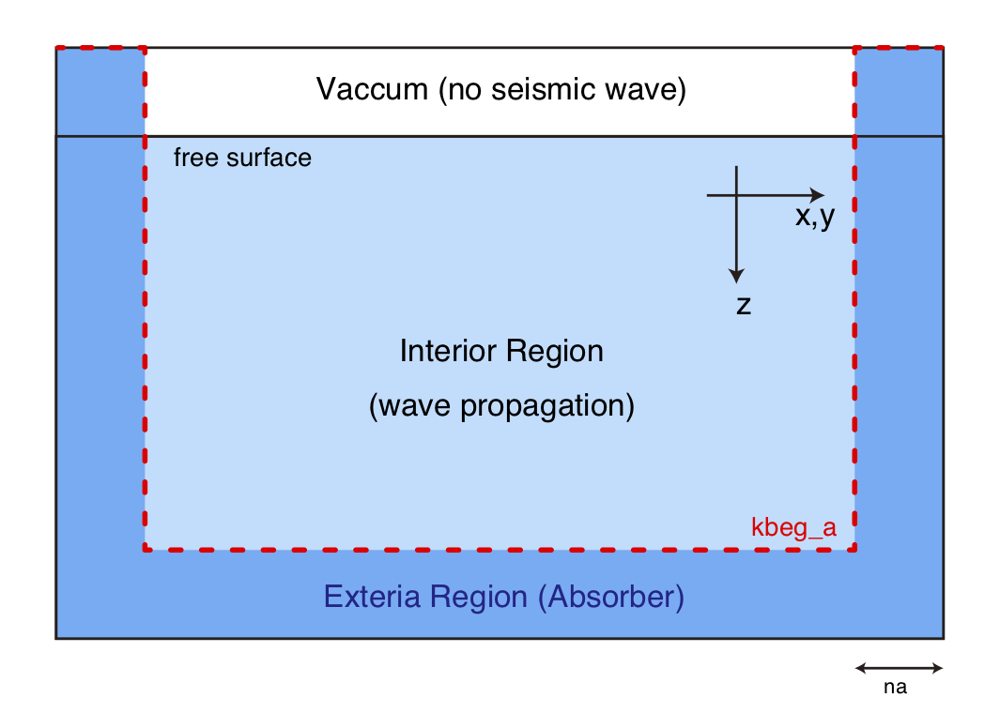

# Absorbing Boundary Conditions

Users can choose an absorbing boundary condition from the auxiliary
differential equation, the complex frequency-shifted perfectly matched
layer (ADE CFS-PML; Zhang et al., 2010[^Zhang2010]）, and Cerjan's sponge condition
(Cerjan et al., 1985[^Cerjan1985]).0

[^Zhang2010]: Zhang, W., and Y. Shen (2010), Unsplit complex frequency-shifted PML implementation using auxiliary differential equations for seismic wave modeling, _Geophysics_, _75_(4), T141–T154, doi:10.1190/1.3463431.

[^Cerjan1985]: Cerjan, C., D. Kosloff, R. Kosloff, and M. Reshef (1985), A nonreflecting boundary condition for discrete acoustic and elastic wave equations, _Geophysics_, _50_(4), 705–708.

The entire computational domain is separated into interior and exterior
regions by the thickness of the absorber `na`, as shown in the following figure.

!!! Figure
    
    Schematic of the definition of the absorber region. The red dotted line indicates the location of `kbeg_a(I,J)`.

Because this program assumes the existence of a free surface and ignores acoustic waves in the air
column, the waves in the top boundary will not be absorbed. At a given
horizontal grid location `(I,J)`, the depth grid deeper than `kbeg_a`
will be used as the attenuator.

For computational efficiency in the PML boundary condition, `OpenSWPC`
does not solve the viscoelastic constitutive equation in the absorber.
Note that, in the case of a medium having very small $Q$ values, this
may lead to a velocity gap between the interior and exterior regions due
to physical dispersion.

For Cerjan's absorbing condition, the parameters suggested by
[@Cerjan:1985uz] are embedded in the source code. However, these
parameters are scaled according to the width of the absorber `na`.

The PML absorber is usually superior to the Cerjan's sponge condition in its
efficiency in avoiding artificial reflection from the boundaries.
However, PML occasionally results in numerical instabilities,
particularly for a medium with a strong velocity contrast and after
several time steps. In case if such instability occurs, the following empirical remedies might work: 

- Slightly change the computational area by changing `clon` and `clat`, or `nx` and `ny`
- Eliminate very-low velocity layers in the absorber region by setting `stabilize_pml = .true.` 
- Elongate the rise time of the source time function to reduce high-frequency wave components. 

The Cerjan's sponge always gives a very stable result.

!!! Info "Parameters"

    **`abc_type`**
    : Type of the absorbing boundary condition. Choose from `’pml’` or
    `’cerjan’`.

    **`na`**
    : Thickness of the absorbing layer in numbers of grids. Usually, 10-20
    grids are chosen.

    **`stabilize_pml`**
    : The low velocity layer is removed if this flag is `.true.`, to
    stabilize PML. This option may increase the amplitude or artificial reflection as a side effect. 

<!---
    **`fullspace_mode`** (new in version 5.2)
    : Apply the absorbing boundary condition at the lower end of the $z$-axis. Usually this is not necessary as there is a air (vacuum) column at the shallowmost portion. This option may be useful for simulating wave propagation in full-space without surface. Note that most of the ready-made velocity structure assumes the existance of the free surface. One may have to prepare the one's own velocity structure (by modifying the `user` velocity model code) to fully utilize this mode. 
    
!!! Caution
    Fullspace mode fully works after version 5.2. Fullspace mode works only in 2D codes between Versions 5.0 and 5.1.
---> 

!!! Caution
    The `fullspace_mode` implemented in Version 5.0 -- 5.1 has been temporarily disabled because it was found to cause trouble in certain environments even when the mode was not set. The cause of the trouble is being investigated. 