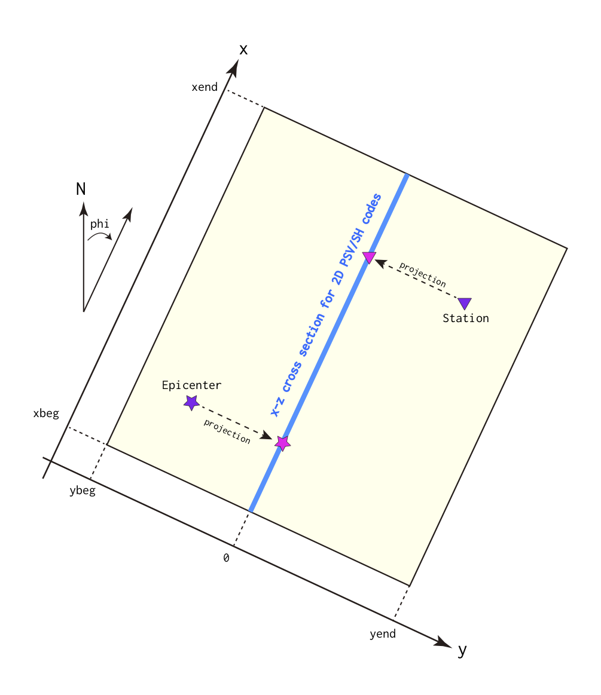

# About Two-Dimensional Codes

`OpenSWPC` contains P-SV (`swpc_psv`) and SH (`swpc_sh`) codes, which work
with the same parameter file. In these 2D codes, the simulation will be
performed along the $x--z$ cross section of $y=0$. The parameters
related to the $y$-direction will be omitted. The MPI partition will,
therefore, be 1D, only in the x-direction. Note that all stations and
sources outside the cross section will be projected onto the cross
section, as schematically shown in the next figure. 

!!! Figure
    
    Projection to the two-dimensional model in the horizontal space.  

For plane wave incidence, `pw_strike` and `pw_rake` will be fixed according
to the type of code. Only the dip angle (`pw_dip`) can be changed.

## About the results of the 2D code

In seismic wave propagation, the 3D and 2D problems are essentially different. 2D simulations are equivalent to assuming an infinite linear source in the $y$ direction in 3D space, and the amplitude and geometric attenuation of seismic waves are significantly different from those in 3D. Therefore, it is very dangerous to quantitatively compare the seismic waveforms of the 2D simulation results with the observed records.

However, under certain assumptions, there is a method to convert the results of 2D codes into seismic waveforms in 3D space with uniform structure in the $y$ direction. After version 5.2, a utility program [wvconv](../3._Tools/0306_misc.en.md) can be used to realize such a conversion.
