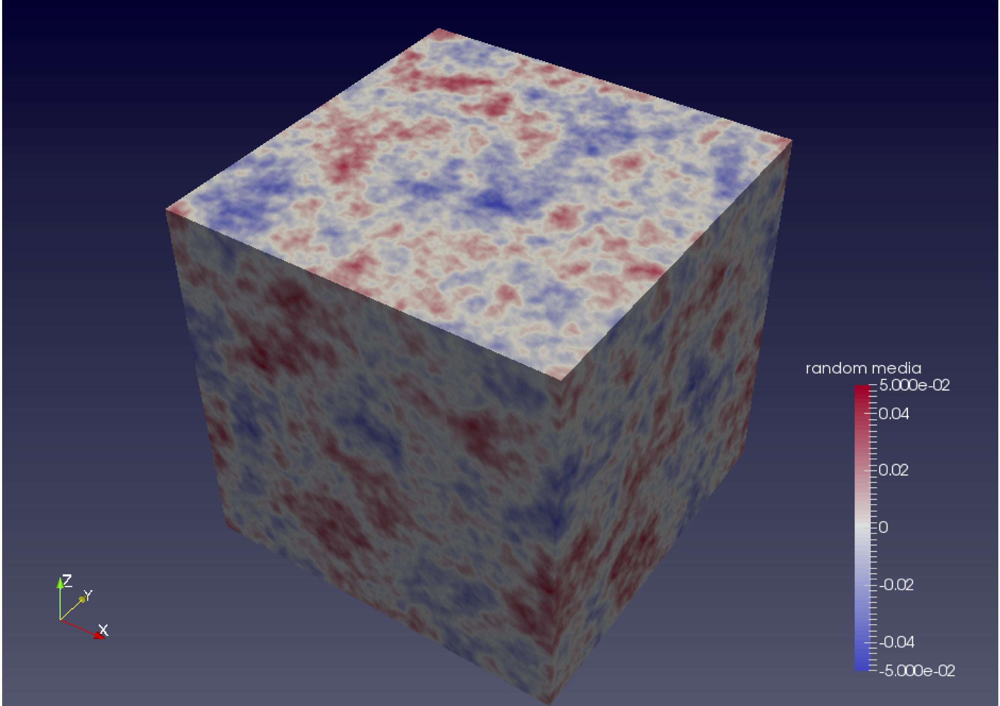

# Generation of Random Media

## `gen_rmed3d.x`

Generate a three-dimensional random medium file.

```
gen_rmed3d.x  [-o outfile] [-nx nx] [-ny ny] [-nz nz] [-epsil epsilon]  [-kappa kappa] 
               [-dx dx] [-dy dy] [-dz dz] [-ax ax] [-ay ay] [-az az]  
               [-ptype ptype] {-seed seed_number}
```

`-o outfile`

:    
    Name of the output file.

`-nx nx`, `-ny ny` `-nz nz`

:    
    Number of grids in the $x$-, $y$-, and $z$-directions. They must be
    a power of 2.

`-epsil epsilon`

:    
    Root mean square (RMS) of the velocity fluctuation $\varepsilon$.

`-ax ax`, `-ay ay`, `-az az`

:    
    Characteristic scales in the $x$-, $y$-, and $z$-directions in units
    of km.

`-dx dx -dy dy -dz dz`

:    
    Grid width in the $x$-, $y$-, and $z$-directions. They should be
    identical to the simulation parameters.

`-ptype ptype`

:    
    Choice of power spectrum density functions (PSDFs) of the random
    media model in wavenumber space: 1 for Gaussian, 2 for Exponential,
    and 3 for von Kármán.

`-kappa kappa`

:    
    The parameter $\kappa$ for the von Kármán-type PSDF.

`-seed seed_number`

:    
    Specify the seed number of the random variable generation
    (optional). If this option is not specified, the seed number is
    automatically generated based on the execution date and time.


The random media file will be stored in the `NetCDF` format. Various
software, such as [`ParaView`](https://www.paraview.org) and [`Panoply`](https://www.giss.nasa.gov/tools/panoply/) can be used for visualization

!!! Figure 
    
    An example of 3D random media generated by `gen_rmed3d.x` and visualized by `ParaView`. 

## `gen_rmed2d.x`

Generate a 2D random media file. Its usage is same as that of
`gen_rmed3d.x`, with parameters related to the y-direction omitted.
