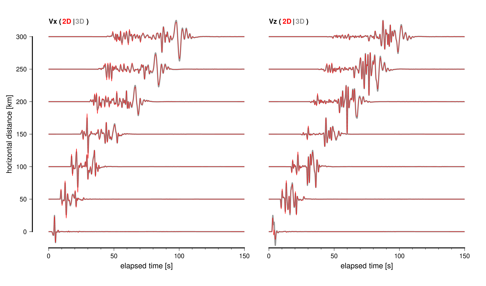

# その他のツール

## timvis tools

`timvis.gmt` と `timvis_abs.gmt` は`stopwatch_mode = .true.`の際に出力される経過時間ファイルを解析し，各計算ノードでサブルーチン毎の計算負荷のバランスを可視化する．GMTバージョン5以降が必要である．

## 地理座標変換

`ll2xy.x`と`xy2ll.x`は，で採用されているガウス・クリューゲル変換によって緯度経度とデカルト座標系の相互変換を行うツールである．

## 2D-3D変換ツール wvconv.x

**New in version 5.2**

`wvconv.x` は2次元シミュレーションの結果に基づいて，3次元シミュレーション相当の地震波形に変換するツールである．

震源位置$(\xi, \eta, \zeta)$の点震源による3次元空間の地震波形$V_{3D}(\xi, \eta, \zeta, t)$は，震源位置$(\xi, \zeta)$による2次元空間の地震波形$V_{2D}(\xi,\zeta, t)$と，以下のような関係にある: 

$$
\begin{align}
V_{2D}(\xi, \zeta, t) = \int_{-\infty}^\infty V_{3D}(\xi, \eta, \zeta, t) d \eta 
\end{align}
$$

つまり，$V_{3D}$を$y$軸方向に震源について積分した線震源による地震波が2次元シミュレーションの結果である．一方，この逆変換は，

$$
\begin{align}
    V_{3D}(\xi, \eta=0, \zeta, t) = \frac{1}{\pi} 
    \sqrt{\frac{1}{2 R v}} 
    \frac{d}{dt}
    \left[ \frac{1}{\sqrt{t}} \ast V_{2D}(\xi, \zeta, t) \right]
\end{align}
$$

によって計算できる[^1]．ここで$R$は伝播距離，$v$は各地震波相の速度である．記号$\ast$は畳み込みを表す．

ツール `wvconv.x` は，$R$と$v$一定の仮定のもとで，周波数領域による計算

$$
\begin{align}
    & \widetilde{V}_{2D} (\xi, \zeta, f) = \int_{-\infty}^\infty 
    V_{2D} (\xi, \zeta, f) e^{i 2 \pi f t} dt 
    \\
    & V_{3D}(\xi, \eta=0, \zeta, t) = 
    \int_{-\infty}^\infty     \sqrt{-\frac{i f}{Rv}}
    \widetilde{V}_{2D} (\xi, \zeta, f)
    e^{-i 2 \pi f t} d f
\end{align}
$$

によって3次元空間における模擬波形を計算する．ここで$R$は震源観測点からの直線距離で，$v$の値はパラメタとして与えることもできるが，デフォルトでは$v=4000$ m/sを仮定して計算する．


#### Usage

```
wvconv.x in.sac out.sac (V0)
     in.sac: input SAC file (must be 2D simulation output)
     out.sac: output SAC filename
     V0 (optional): assumed average velocity in m/s unit. Default is 4000 m/s
```

一例として，`example/lhm.dat`の1次元構造で計算したP-SV2次元コードによる波形から`wvconv.x`により変換した（$V=4000$ m/s）波形と，同じ構造での3次元計算の結果の比較を下図に示す．

!!! Quote "Figure"
    
    3次元シミュレーション結果（灰色線）と2次元P-SVシミュレーション結果を`wvconv.x`で変換したもの（赤線）の比較．

地震波相の速度を4000 m/sと仮定するため，そこから外れるP波や表面波後続相では若干の振幅の違いが見られるが，全般的に波形は非常によく一致している．もし`wvconv.x`を介さずに比較すると，振幅も波形形状もまったく異なる．

!!! Warning
    `wvconv.x`はVersion 5.2で新たに導入されたコードであり，まだ十分に枯れていない．利用には細心の注意を払って欲しい．

[^1]: Li, D., Helmberger, D., Clayton, R. W., & Sun, D. (2014). Global synthetic seismograms using a 2-D finite-difference method. Geophysical Journal International, 197(2), 1166–1183. doi:10.1093/gji/ggu050