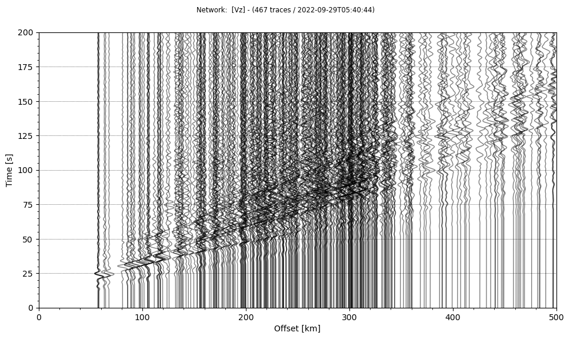
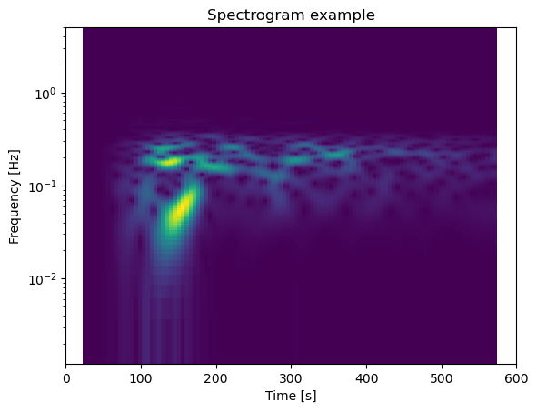
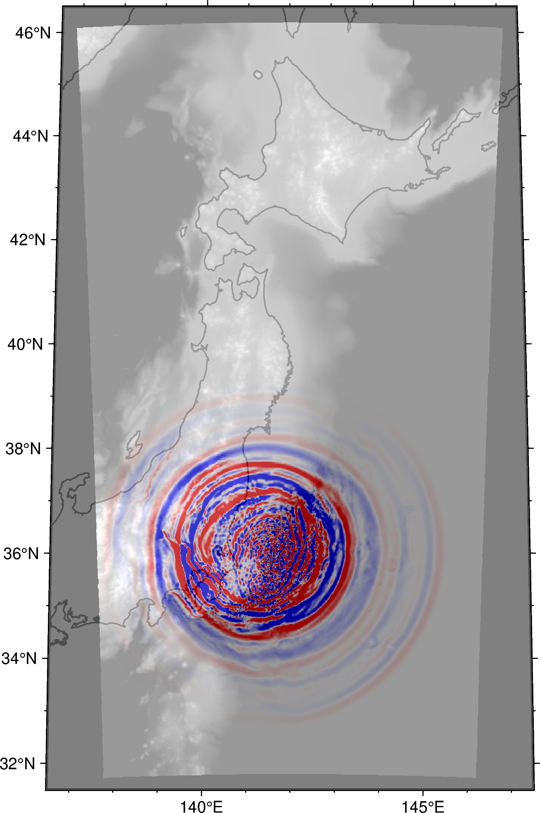

# Python integration

New in version 5.3.0!

Python is a rapidly glowing ecosystem for data analysis and visualization in seismology. Followings are some tips & tricks for those who would like to handle the input/output of the OpenSWPC in python. The following example uses 

- ObsPy
- numpy
- xarray
- PyGMT

under the Jupyter Notebook environment. 

## Input parameter files

A python module `OpenSWPC/src/tools/swpc.py` contains several utility functions to handle input parameter to the OpenSWPC. To use it, first add this directory to the module path:


```python
import sys
sys.path.append('/path/to/OpenSWPC/src/tools/')
```

Then, the module can be loaded as follows: 


```python
import swpc
```

A function `prm_new()` create the default parameter set. These parameters are equivalent to that defined in `example/input.inf`.


```python
prm0 = swpc.prm_new()
```

In python, parameter data are stored in a simple dictionary as shown below. Thus, the user can easily change the parameter values if necessary. 


```python
print(prm0)
```

    {
     'title': 'swpc', 'odir': './out', 'ntdec_r': 50, 'strict_mode': False, 
     'nproc_x': 2, 'nproc_y': 2, 'nx': 384, 'ny': 384, 'nz': 384, 'nt': 1000, 
     'dx': 0.5, 'dy': 0.5, 'dz': 0.5, 'dt': 0.02, 'vcut': 1.5, 
     'xbeg': -96.0, 'ybeg': -96.0, 'zbeg': -10.0, 'tbeg': 0.0, 'clon': 139.7604, 'clat': 35.7182, 
     'phi': 0.0, 'fq_min': 0.02, 'fq_max': 2.0, 'fq_ref': 1.0, 'snp_format': 'netcdf', 
     'xy_ps%sw': False, 'xz_ps%sw': True, 'yz_ps%sw': False, 'fs_ps%sw': False, 
     'ob_ps%sw': True, 'xy_v%sw': False, 'xz_v%sw': True, 'yz_v%sw': False, 
     'fs_v%sw': False, 'ob_v%sw': True, 'xy_u%sw': False, 'xz_u%sw': True, 
     'yz_u%sw': False, 'fs_u%sw': False, 'ob_u%sw': True, 
     'z0_xy': 7.0, 'x0_yz': 0.0, 'y0_xz': 0.0, 'ntdec_s': 5, 
     'idec': 2, 'jdec': 2, 'kdec': 2, 'sw_wav_v': True, 'sw_wav_u': False, 
     'sw_wav_stress': False, 'sw_wav_strain': False, 'ntdec_w': 5, 
     'st_format': 'xy', 'fn_stloc': './example/stloc.xy', 'wav_format': 'sac', 
     'wav_calc_dist': False, 'stf_format': 'xym0ij', 'stftype': 'kupper', 
     'fn_stf': './example/source.dat', 'sdep_fit': 'asis', 'bf_mode': False, 
     'pw_mode': False, 'pw_ztop': 100.0, 'pw_zlen': 30.0, 'pw_ps': 'p', 
     'pw_strike': 0.0, 'pw_dip': 0.0, 'pw_rake': 0.0, 'abc_type': 'pml', 
     'na': 20, 'stabilize_pml': False, 'vmodel_type': 'lhm', 'is_ocean': True, 
     'topo_flatten': False, 'munk_profile': True, 'earth_flattening': False, 
     'vp0': 5.0, 'vs0': 3.0, 'rho0': 2.7, 'qp0': 200, 'qs0': 200, 'topo0': 0, 
     'dir_grd': '${DATASET}/vmodel/ejivsm/', 'fn_grdlst': './example/grd.lst', 
     'node_grd': 0, 'fn_lhm': 'example/lhm.dat', 'dir_rmed': './in/', 
     'fn_grdlst_rmed': './example/grd.lst', 'rhomin': 1.0, 'fn_rmed0': 'dummy.ns', 
     'is_ckp': False, 'ckpdir': './out/ckp', 'ckp_interval': 1000000, 
     'ckp_time': 1000000.0, 'ckp_seq': True, 'green_mode': False, 'green_stnm': 'st01', 
     'green_cmp': 'z', 'green_trise': 1.0, 'green_bforce': False, 'green_maxdist': 550.0,
     'green_fmt': 'llz', 'fn_glst': 'example/green.lst', 'stopwatch_mode': False, 
     'benchmark_mode': False, 'ipad': 0, 'jpad': 0, 'kpad': 0
    }


Also, one can read the parameter file by using `prm_read()` function. The following 


```python
prm1 = swpc.prm_read('/path/to/OpenSWPC/example/input.inf')
```


Apply some modification to the `prm1` ...


```python
prm1['title'] = 'new-simulation'
prm1['nx'] = 1024
prm1['ny'] = 1024
prm1['nz'] = 1024
```

To save the parameter to use in OpenSWPC, use `prm_print()` function. In default, this function exports all parameters to standard output. The followings are an example to save the parameter to file: 


```python
with open('swpc.prm', 'w') as fp:
    swpc.prm_print(prm1, io=fp)
```

Confirm the modified parameter is stored in the specified file: 


```python
! head swpc.prm
```

    title              =   'new-simulation'
    odir               =   './out'
    ntdec_r            =   50
    strict_mode        =   .false.
    nproc_x            =   2
    nproc_y            =   2
    nx                 =   1024
    ny                 =   1024
    nz                 =   1024
    nt                 =   1000


## Output waveforms

[ObsPy](https://github.com/obspy/obspy/wiki/) is a de-facto standard on reading seismograms and applying basic manipulation of seismic data. Since the ObsPy can directly read the SAC-formatted seismogram, one can easily import the output waveform data generated by the OpenSWPC without any additional processings. 

Note that some user reported that the ObsPy occasionaly fails to specify the format when it reads SAC files produced by OpenSWPC properly. It is recommended to add `format='sac'` option to `obspy.read()` function to explicitly tell this is SAC-formatted file. 


```python
ls /path/to/OpenSWPC/output/wav/swpc_N.N.AAKH.Vz.sac
```

  /path/to/OpenSWPC/output/wav/swpc_N.N.AAKH.Vz.sac


```python
import obspy
```


```python
tr = obspy.read('/path/to/OpenSWPC/output/wav/*.Vz.sac', format='sac')
```


```python
# set distance to stats
# original distance header in stats.sac.dist is not read by record section plot function in obspy
for t in tr:
    t.stats.distance = t.stats.sac.dist * 1000
```


```python
tr.plot(type='section', scale=5, offset_min=0, offset_max=500*1000, recordlength=200, reduce = 7).show()
```


    

    


```python
tr[10].spectrogram(wlen=60, log=True, title='Spectrogram example')
```


    

    


## Output snapshots

2D snapshot data produced by OpenSWPC follows the [CF metadata conventions](https://cfconventions.org/) of [NetCDF](https://www.unidata.ucar.edu/software/netcdf/index.html) format. There seems several libraries to read NetCDF files, and here is an exaple using [xarray](https://docs.xarray.dev/en/stable/) which has an affinity to the [PyGMT](https://www.pygmt.org/latest/). 


```python
fn_ob = '/path/to/OpenSWPC/output/swpc_N.ob.v.nc'
```


```python
import xarray as xr
```


```python
xr_ob = xr.open_dataset(fn_ob)
```

xarray dataset contains multiple list (array) data, as the NetCDF data format: 


```python
xr_ob
```


<div><svg style="position: absolute; width: 0; height: 0; overflow: hidden">
<defs>
<symbol id="icon-database" viewBox="0 0 32 32">
<path d="M16 0c-8.837 0-16 2.239-16 5v4c0 2.761 7.163 5 16 5s16-2.239 16-5v-4c0-2.761-7.163-5-16-5z"></path>
<path d="M16 17c-8.837 0-16-2.239-16-5v6c0 2.761 7.163 5 16 5s16-2.239 16-5v-6c0 2.761-7.163 5-16 5z"></path>
<path d="M16 26c-8.837 0-16-2.239-16-5v6c0 2.761 7.163 5 16 5s16-2.239 16-5v-6c0 2.761-7.163 5-16 5z"></path>
</symbol>
<symbol id="icon-file-text2" viewBox="0 0 32 32">
<path d="M28.681 7.159c-0.694-0.947-1.662-2.053-2.724-3.116s-2.169-2.030-3.116-2.724c-1.612-1.182-2.393-1.319-2.841-1.319h-15.5c-1.378 0-2.5 1.121-2.5 2.5v27c0 1.378 1.122 2.5 2.5 2.5h23c1.378 0 2.5-1.122 2.5-2.5v-19.5c0-0.448-0.137-1.23-1.319-2.841zM24.543 5.457c0.959 0.959 1.712 1.825 2.268 2.543h-4.811v-4.811c0.718 0.556 1.584 1.309 2.543 2.268zM28 29.5c0 0.271-0.229 0.5-0.5 0.5h-23c-0.271 0-0.5-0.229-0.5-0.5v-27c0-0.271 0.229-0.5 0.5-0.5 0 0 15.499-0 15.5 0v7c0 0.552 0.448 1 1 1h7v19.5z"></path>
<path d="M23 26h-14c-0.552 0-1-0.448-1-1s0.448-1 1-1h14c0.552 0 1 0.448 1 1s-0.448 1-1 1z"></path>
<path d="M23 22h-14c-0.552 0-1-0.448-1-1s0.448-1 1-1h14c0.552 0 1 0.448 1 1s-0.448 1-1 1z"></path>
<path d="M23 18h-14c-0.552 0-1-0.448-1-1s0.448-1 1-1h14c0.552 0 1 0.448 1 1s-0.448 1-1 1z"></path>
</symbol>
</defs>
</svg>
<style>/* CSS stylesheet for displaying xarray objects in jupyterlab.
 *
 */

:root {
  --xr-font-color0: var(--jp-content-font-color0, rgba(0, 0, 0, 1));
  --xr-font-color2: var(--jp-content-font-color2, rgba(0, 0, 0, 0.54));
  --xr-font-color3: var(--jp-content-font-color3, rgba(0, 0, 0, 0.38));
  --xr-border-color: var(--jp-border-color2, #e0e0e0);
  --xr-disabled-color: var(--jp-layout-color3, #bdbdbd);
  --xr-background-color: var(--jp-layout-color0, white);
  --xr-background-color-row-even: var(--jp-layout-color1, white);
  --xr-background-color-row-odd: var(--jp-layout-color2, #eeeeee);
}

html[theme=dark],
body[data-theme=dark],
body.vscode-dark {
  --xr-font-color0: rgba(255, 255, 255, 1);
  --xr-font-color2: rgba(255, 255, 255, 0.54);
  --xr-font-color3: rgba(255, 255, 255, 0.38);
  --xr-border-color: #1F1F1F;
  --xr-disabled-color: #515151;
  --xr-background-color: #111111;
  --xr-background-color-row-even: #111111;
  --xr-background-color-row-odd: #313131;
}

.xr-wrap {
  display: block !important;
  min-width: 300px;
  max-width: 700px;
}

.xr-text-repr-fallback {
  /* fallback to plain text repr when CSS is not injected (untrusted notebook) */
  display: none;
}

.xr-header {
  padding-top: 6px;
  padding-bottom: 6px;
  margin-bottom: 4px;
  border-bottom: solid 1px var(--xr-border-color);
}

.xr-header > div,
.xr-header > ul {
  display: inline;
  margin-top: 0;
  margin-bottom: 0;
}

.xr-obj-type,
.xr-array-name {
  margin-left: 2px;
  margin-right: 10px;
}

.xr-obj-type {
  color: var(--xr-font-color2);
}

.xr-sections {
  padding-left: 0 !important;
  display: grid;
  grid-template-columns: 150px auto auto 1fr 20px 20px;
}

.xr-section-item {
  display: contents;
}

.xr-section-item input {
  display: none;
}

.xr-section-item input + label {
  color: var(--xr-disabled-color);
}

.xr-section-item input:enabled + label {
  cursor: pointer;
  color: var(--xr-font-color2);
}

.xr-section-item input:enabled + label:hover {
  color: var(--xr-font-color0);
}

.xr-section-summary {
  grid-column: 1;
  color: var(--xr-font-color2);
  font-weight: 500;
}

.xr-section-summary > span {
  display: inline-block;
  padding-left: 0.5em;
}

.xr-section-summary-in:disabled + label {
  color: var(--xr-font-color2);
}

.xr-section-summary-in + label:before {
  display: inline-block;
  content: '►';
  font-size: 11px;
  width: 15px;
  text-align: center;
}

.xr-section-summary-in:disabled + label:before {
  color: var(--xr-disabled-color);
}

.xr-section-summary-in:checked + label:before {
  content: '▼';
}

.xr-section-summary-in:checked + label > span {
  display: none;
}

.xr-section-summary,
.xr-section-inline-details {
  padding-top: 4px;
  padding-bottom: 4px;
}

.xr-section-inline-details {
  grid-column: 2 / -1;
}

.xr-section-details {
  display: none;
  grid-column: 1 / -1;
  margin-bottom: 5px;
}

.xr-section-summary-in:checked ~ .xr-section-details {
  display: contents;
}

.xr-array-wrap {
  grid-column: 1 / -1;
  display: grid;
  grid-template-columns: 20px auto;
}

.xr-array-wrap > label {
  grid-column: 1;
  vertical-align: top;
}

.xr-preview {
  color: var(--xr-font-color3);
}

.xr-array-preview,
.xr-array-data {
  padding: 0 5px !important;
  grid-column: 2;
}

.xr-array-data,
.xr-array-in:checked ~ .xr-array-preview {
  display: none;
}

.xr-array-in:checked ~ .xr-array-data,
.xr-array-preview {
  display: inline-block;
}

.xr-dim-list {
  display: inline-block !important;
  list-style: none;
  padding: 0 !important;
  margin: 0;
}

.xr-dim-list li {
  display: inline-block;
  padding: 0;
  margin: 0;
}

.xr-dim-list:before {
  content: '(';
}

.xr-dim-list:after {
  content: ')';
}

.xr-dim-list li:not(:last-child):after {
  content: ',';
  padding-right: 5px;
}

.xr-has-index {
  font-weight: bold;
}

.xr-var-list,
.xr-var-item {
  display: contents;
}

.xr-var-item > div,
.xr-var-item label,
.xr-var-item > .xr-var-name span {
  background-color: var(--xr-background-color-row-even);
  margin-bottom: 0;
}

.xr-var-item > .xr-var-name:hover span {
  padding-right: 5px;
}

.xr-var-list > li:nth-child(odd) > div,
.xr-var-list > li:nth-child(odd) > label,
.xr-var-list > li:nth-child(odd) > .xr-var-name span {
  background-color: var(--xr-background-color-row-odd);
}

.xr-var-name {
  grid-column: 1;
}

.xr-var-dims {
  grid-column: 2;
}

.xr-var-dtype {
  grid-column: 3;
  text-align: right;
  color: var(--xr-font-color2);
}

.xr-var-preview {
  grid-column: 4;
}

.xr-var-name,
.xr-var-dims,
.xr-var-dtype,
.xr-preview,
.xr-attrs dt {
  white-space: nowrap;
  overflow: hidden;
  text-overflow: ellipsis;
  padding-right: 10px;
}

.xr-var-name:hover,
.xr-var-dims:hover,
.xr-var-dtype:hover,
.xr-attrs dt:hover {
  overflow: visible;
  width: auto;
  z-index: 1;
}

.xr-var-attrs,
.xr-var-data {
  display: none;
  background-color: var(--xr-background-color) !important;
  padding-bottom: 5px !important;
}

.xr-var-attrs-in:checked ~ .xr-var-attrs,
.xr-var-data-in:checked ~ .xr-var-data {
  display: block;
}

.xr-var-data > table {
  float: right;
}

.xr-var-name span,
.xr-var-data,
.xr-attrs {
  padding-left: 25px !important;
}

.xr-attrs,
.xr-var-attrs,
.xr-var-data {
  grid-column: 1 / -1;
}

dl.xr-attrs {
  padding: 0;
  margin: 0;
  display: grid;
  grid-template-columns: 125px auto;
}

.xr-attrs dt,
.xr-attrs dd {
  padding: 0;
  margin: 0;
  float: left;
  padding-right: 10px;
  width: auto;
}

.xr-attrs dt {
  font-weight: normal;
  grid-column: 1;
}

.xr-attrs dt:hover span {
  display: inline-block;
  background: var(--xr-background-color);
  padding-right: 10px;
}

.xr-attrs dd {
  grid-column: 2;
  white-space: pre-wrap;
  word-break: break-all;
}

.xr-icon-database,
.xr-icon-file-text2 {
  display: inline-block;
  vertical-align: middle;
  width: 1em;
  height: 1.5em !important;
  stroke-width: 0;
  stroke: currentColor;
  fill: currentColor;
}
</style><pre class='xr-text-repr-fallback'>&lt;xarray.Dataset&gt;
Dimensions:  (x: 1067, y: 533, t: 600)
Coordinates:
  * x        (x) float32 -799.2 -797.8 -796.2 -794.8 ... 795.2 796.8 798.2 799.8
  * y        (y) float32 -399.2 -397.8 -396.2 -394.8 ... 394.2 395.8 397.2 398.8
  * t        (t) float32 0.025 1.025 2.025 3.025 ... 596.0 597.0 598.0 599.0
    lon      (y, x) float32 ...
    lat      (y, x) float32 ...
Data variables:
    rho      (y, x) float32 ...
    lambda   (y, x) float32 ...
    mu       (y, x) float32 ...
    topo     (y, x) float32 ...
    Vx       (t, y, x) float32 ...
    Vy       (t, y, x) float32 ...
    Vz       (t, y, x) float32 ...
    max-V    (y, x) float32 ...
    max-H    (y, x) float32 ...
    max-A    (y, x) float32 ...
Attributes: (12/26)
    generated_by:  SWPC
    codetype:      SWPC_3D
    hdrver:        6
    title:         swpc_N
    exedate:       1664430044
    ns1:           1067
    ...            ...
    evdp:          43.18
    evx:           -320.6624
    evy:           -66.1461
    clon:          142.0
    clat:          39.0
    phi:           0.0</pre><div class='xr-wrap' style='display:none'><div class='xr-header'><div class='xr-obj-type'>xarray.Dataset</div></div><ul class='xr-sections'><li class='xr-section-item'><input id='section-9669b4fc-3fc0-48f6-af46-18749beb9071' class='xr-section-summary-in' type='checkbox' disabled ><label for='section-9669b4fc-3fc0-48f6-af46-18749beb9071' class='xr-section-summary'  title='Expand/collapse section'>Dimensions:</label><div class='xr-section-inline-details'><ul class='xr-dim-list'><li><span class='xr-has-index'>x</span>: 1067</li><li><span class='xr-has-index'>y</span>: 533</li><li><span class='xr-has-index'>t</span>: 600</li></ul></div><div class='xr-section-details'></div></li><li class='xr-section-item'><input id='section-5e6d95a5-a80f-4b31-96e2-677f5fe9c721' class='xr-section-summary-in' type='checkbox'  checked><label for='section-5e6d95a5-a80f-4b31-96e2-677f5fe9c721' class='xr-section-summary' >Coordinates: <span>(5)</span></label><div class='xr-section-inline-details'></div><div class='xr-section-details'><ul class='xr-var-list'><li class='xr-var-item'><div class='xr-var-name'><span class='xr-has-index'>x</span></div><div class='xr-var-dims'>(x)</div><div class='xr-var-dtype'>float32</div><div class='xr-var-preview xr-preview'>-799.2 -797.8 ... 798.2 799.8</div><input id='attrs-2e353b8b-edd0-4541-9490-fb29115da8ee' class='xr-var-attrs-in' type='checkbox' ><label for='attrs-2e353b8b-edd0-4541-9490-fb29115da8ee' title='Show/Hide attributes'><svg class='icon xr-icon-file-text2'><use xlink:href='#icon-file-text2'></use></svg></label><input id='data-c2bc1ba2-9169-448a-b154-20a077d8a2ff' class='xr-var-data-in' type='checkbox'><label for='data-c2bc1ba2-9169-448a-b154-20a077d8a2ff' title='Show/Hide data repr'><svg class='icon xr-icon-database'><use xlink:href='#icon-database'></use></svg></label><div class='xr-var-attrs'><dl class='xr-attrs'><dt><span>long_name :</span></dt><dd>x</dd><dt><span>standard_name :</span></dt><dd>projection_x_coordinate</dd><dt><span>units :</span></dt><dd>km</dd><dt><span>actual_range :</span></dt><dd>[-799.25  799.75]</dd></dl></div><div class='xr-var-data'><pre>array([-799.25, -797.75, -796.25, ...,  796.75,  798.25,  799.75],
      dtype=float32)</pre></div></li><li class='xr-var-item'><div class='xr-var-name'><span class='xr-has-index'>y</span></div><div class='xr-var-dims'>(y)</div><div class='xr-var-dtype'>float32</div><div class='xr-var-preview xr-preview'>-399.2 -397.8 ... 397.2 398.8</div><input id='attrs-93f5887d-f377-4214-9b65-43b671865c1f' class='xr-var-attrs-in' type='checkbox' ><label for='attrs-93f5887d-f377-4214-9b65-43b671865c1f' title='Show/Hide attributes'><svg class='icon xr-icon-file-text2'><use xlink:href='#icon-file-text2'></use></svg></label><input id='data-6d75ae32-ba53-4e17-ba46-005cca9b5435' class='xr-var-data-in' type='checkbox'><label for='data-6d75ae32-ba53-4e17-ba46-005cca9b5435' title='Show/Hide data repr'><svg class='icon xr-icon-database'><use xlink:href='#icon-database'></use></svg></label><div class='xr-var-attrs'><dl class='xr-attrs'><dt><span>long_name :</span></dt><dd>y</dd><dt><span>standard_name :</span></dt><dd>projection_y_coordinate</dd><dt><span>units :</span></dt><dd>km</dd><dt><span>actual_range :</span></dt><dd>[-399.25  398.75]</dd></dl></div><div class='xr-var-data'><pre>array([-399.25, -397.75, -396.25, ...,  395.75,  397.25,  398.75],
      dtype=float32)</pre></div></li><li class='xr-var-item'><div class='xr-var-name'><span class='xr-has-index'>t</span></div><div class='xr-var-dims'>(t)</div><div class='xr-var-dtype'>float32</div><div class='xr-var-preview xr-preview'>0.025 1.025 2.025 ... 598.0 599.0</div><input id='attrs-c4c7c162-e555-4a48-887d-e0d49c8353c8' class='xr-var-attrs-in' type='checkbox' ><label for='attrs-c4c7c162-e555-4a48-887d-e0d49c8353c8' title='Show/Hide attributes'><svg class='icon xr-icon-file-text2'><use xlink:href='#icon-file-text2'></use></svg></label><input id='data-a63b2c3e-522b-4a92-8b6b-c43e11aa793b' class='xr-var-data-in' type='checkbox'><label for='data-a63b2c3e-522b-4a92-8b6b-c43e11aa793b' title='Show/Hide data repr'><svg class='icon xr-icon-database'><use xlink:href='#icon-database'></use></svg></label><div class='xr-var-attrs'><dl class='xr-attrs'><dt><span>long_name :</span></dt><dd>t</dd><dt><span>units :</span></dt><dd>s</dd></dl></div><div class='xr-var-data'><pre>array([2.50000e-02, 1.02500e+00, 2.02500e+00, ..., 5.97025e+02, 5.98025e+02,
       5.99025e+02], dtype=float32)</pre></div></li><li class='xr-var-item'><div class='xr-var-name'><span>lon</span></div><div class='xr-var-dims'>(y, x)</div><div class='xr-var-dtype'>float32</div><div class='xr-var-preview xr-preview'>...</div><input id='attrs-a5f0e6d4-c081-4512-b6eb-b74d7a55ea28' class='xr-var-attrs-in' type='checkbox' ><label for='attrs-a5f0e6d4-c081-4512-b6eb-b74d7a55ea28' title='Show/Hide attributes'><svg class='icon xr-icon-file-text2'><use xlink:href='#icon-file-text2'></use></svg></label><input id='data-dc79178c-369e-4bbf-962f-43bb48ad66a3' class='xr-var-data-in' type='checkbox'><label for='data-dc79178c-369e-4bbf-962f-43bb48ad66a3' title='Show/Hide data repr'><svg class='icon xr-icon-database'><use xlink:href='#icon-database'></use></svg></label><div class='xr-var-attrs'><dl class='xr-attrs'><dt><span>long_name :</span></dt><dd>Longitude</dd><dt><span>units :</span></dt><dd>degrees_east</dd><dt><span>actual_range :</span></dt><dd>[136.8374  147.15616]</dd></dl></div><div class='xr-var-data'><pre>[568711 values with dtype=float32]</pre></div></li><li class='xr-var-item'><div class='xr-var-name'><span>lat</span></div><div class='xr-var-dims'>(y, x)</div><div class='xr-var-dtype'>float32</div><div class='xr-var-preview xr-preview'>...</div><input id='attrs-3a950281-1993-420e-9adf-87b4c257fd9d' class='xr-var-attrs-in' type='checkbox' ><label for='attrs-3a950281-1993-420e-9adf-87b4c257fd9d' title='Show/Hide attributes'><svg class='icon xr-icon-file-text2'><use xlink:href='#icon-file-text2'></use></svg></label><input id='data-cba5617c-5143-45d6-9519-1206e98efe0f' class='xr-var-data-in' type='checkbox'><label for='data-cba5617c-5143-45d6-9519-1206e98efe0f' title='Show/Hide data repr'><svg class='icon xr-icon-database'><use xlink:href='#icon-database'></use></svg></label><div class='xr-var-attrs'><dl class='xr-attrs'><dt><span>long_name :</span></dt><dd>Latitude</dd><dt><span>units :</span></dt><dd>degrees_north</dd><dt><span>actual_range :</span></dt><dd>[31.725807 46.200157]</dd></dl></div><div class='xr-var-data'><pre>[568711 values with dtype=float32]</pre></div></li></ul></div></li><li class='xr-section-item'><input id='section-5e73c78f-4085-4e4e-b860-246c2a5d6b87' class='xr-section-summary-in' type='checkbox'  checked><label for='section-5e73c78f-4085-4e4e-b860-246c2a5d6b87' class='xr-section-summary' >Data variables: <span>(10)</span></label><div class='xr-section-inline-details'></div><div class='xr-section-details'><ul class='xr-var-list'><li class='xr-var-item'><div class='xr-var-name'><span>rho</span></div><div class='xr-var-dims'>(y, x)</div><div class='xr-var-dtype'>float32</div><div class='xr-var-preview xr-preview'>...</div><input id='attrs-93a59e38-d878-4f6d-a023-5048953bbc59' class='xr-var-attrs-in' type='checkbox' ><label for='attrs-93a59e38-d878-4f6d-a023-5048953bbc59' title='Show/Hide attributes'><svg class='icon xr-icon-file-text2'><use xlink:href='#icon-file-text2'></use></svg></label><input id='data-b833ced6-10d0-4144-a534-509b9fc71293' class='xr-var-data-in' type='checkbox'><label for='data-b833ced6-10d0-4144-a534-509b9fc71293' title='Show/Hide data repr'><svg class='icon xr-icon-database'><use xlink:href='#icon-database'></use></svg></label><div class='xr-var-attrs'><dl class='xr-attrs'><dt><span>long_name :</span></dt><dd>rho</dd><dt><span>units :</span></dt><dd>10^3 kg/cm^3</dd><dt><span>actual_range :</span></dt><dd>[2.25 3.2 ]</dd></dl></div><div class='xr-var-data'><pre>[568711 values with dtype=float32]</pre></div></li><li class='xr-var-item'><div class='xr-var-name'><span>lambda</span></div><div class='xr-var-dims'>(y, x)</div><div class='xr-var-dtype'>float32</div><div class='xr-var-preview xr-preview'>...</div><input id='attrs-45bacbf9-8051-4fb0-b51f-58842da75e89' class='xr-var-attrs-in' type='checkbox' ><label for='attrs-45bacbf9-8051-4fb0-b51f-58842da75e89' title='Show/Hide attributes'><svg class='icon xr-icon-file-text2'><use xlink:href='#icon-file-text2'></use></svg></label><input id='data-eb9cd394-2867-45d0-8a63-72196f9eb9e8' class='xr-var-data-in' type='checkbox'><label for='data-eb9cd394-2867-45d0-8a63-72196f9eb9e8' title='Show/Hide data repr'><svg class='icon xr-icon-database'><use xlink:href='#icon-database'></use></svg></label><div class='xr-var-attrs'><dl class='xr-attrs'><dt><span>long_name :</span></dt><dd>lambda</dd><dt><span>units :</span></dt><dd>10^9 Pa</dd><dt><span>actual_range :</span></dt><dd>[10.002981 50.560623]</dd></dl></div><div class='xr-var-data'><pre>[568711 values with dtype=float32]</pre></div></li><li class='xr-var-item'><div class='xr-var-name'><span>mu</span></div><div class='xr-var-dims'>(y, x)</div><div class='xr-var-dtype'>float32</div><div class='xr-var-preview xr-preview'>...</div><input id='attrs-07ca0ad6-5ccf-48de-a8b2-912b13c49d02' class='xr-var-attrs-in' type='checkbox' ><label for='attrs-07ca0ad6-5ccf-48de-a8b2-912b13c49d02' title='Show/Hide attributes'><svg class='icon xr-icon-file-text2'><use xlink:href='#icon-file-text2'></use></svg></label><input id='data-ed52cd11-4a96-486a-b1c1-c576c2acabe3' class='xr-var-data-in' type='checkbox'><label for='data-ed52cd11-4a96-486a-b1c1-c576c2acabe3' title='Show/Hide data repr'><svg class='icon xr-icon-database'><use xlink:href='#icon-database'></use></svg></label><div class='xr-var-attrs'><dl class='xr-attrs'><dt><span>long_name :</span></dt><dd>mu</dd><dt><span>units :</span></dt><dd>10^9 Pa</dd><dt><span>actual_range :</span></dt><dd>[ 5.004911 64.35583 ]</dd></dl></div><div class='xr-var-data'><pre>[568711 values with dtype=float32]</pre></div></li><li class='xr-var-item'><div class='xr-var-name'><span>topo</span></div><div class='xr-var-dims'>(y, x)</div><div class='xr-var-dtype'>float32</div><div class='xr-var-preview xr-preview'>...</div><input id='attrs-4e7d53a9-2448-4da0-84ce-b32b7906e531' class='xr-var-attrs-in' type='checkbox' ><label for='attrs-4e7d53a9-2448-4da0-84ce-b32b7906e531' title='Show/Hide attributes'><svg class='icon xr-icon-file-text2'><use xlink:href='#icon-file-text2'></use></svg></label><input id='data-eaaaaf6f-d797-4bcd-aa58-9e17e667473e' class='xr-var-data-in' type='checkbox'><label for='data-eaaaaf6f-d797-4bcd-aa58-9e17e667473e' title='Show/Hide data repr'><svg class='icon xr-icon-database'><use xlink:href='#icon-database'></use></svg></label><div class='xr-var-attrs'><dl class='xr-attrs'><dt><span>long_name :</span></dt><dd>Topography</dd><dt><span>units :</span></dt><dd>m</dd><dt><span>actual_range :</span></dt><dd>[-9315.041   3645.4475]</dd></dl></div><div class='xr-var-data'><pre>[568711 values with dtype=float32]</pre></div></li><li class='xr-var-item'><div class='xr-var-name'><span>Vx</span></div><div class='xr-var-dims'>(t, y, x)</div><div class='xr-var-dtype'>float32</div><div class='xr-var-preview xr-preview'>...</div><input id='attrs-84857ff5-c318-4ef2-9ff0-5ac98526c64e' class='xr-var-attrs-in' type='checkbox' ><label for='attrs-84857ff5-c318-4ef2-9ff0-5ac98526c64e' title='Show/Hide attributes'><svg class='icon xr-icon-file-text2'><use xlink:href='#icon-file-text2'></use></svg></label><input id='data-6da6615a-51d3-412f-b49f-3c484f842517' class='xr-var-data-in' type='checkbox'><label for='data-6da6615a-51d3-412f-b49f-3c484f842517' title='Show/Hide data repr'><svg class='icon xr-icon-database'><use xlink:href='#icon-database'></use></svg></label><div class='xr-var-attrs'><dl class='xr-attrs'><dt><span>long_name :</span></dt><dd>Vx</dd><dt><span>units :</span></dt><dd>m/s</dd><dt><span>actual_range :</span></dt><dd>[-5.082945   4.5914364]</dd></dl></div><div class='xr-var-data'><pre>[341226600 values with dtype=float32]</pre></div></li><li class='xr-var-item'><div class='xr-var-name'><span>Vy</span></div><div class='xr-var-dims'>(t, y, x)</div><div class='xr-var-dtype'>float32</div><div class='xr-var-preview xr-preview'>...</div><input id='attrs-166f5acb-bf70-475e-a5b1-0fd61b9908c4' class='xr-var-attrs-in' type='checkbox' ><label for='attrs-166f5acb-bf70-475e-a5b1-0fd61b9908c4' title='Show/Hide attributes'><svg class='icon xr-icon-file-text2'><use xlink:href='#icon-file-text2'></use></svg></label><input id='data-e9973904-ede8-4f7d-97c8-ef17fef1356c' class='xr-var-data-in' type='checkbox'><label for='data-e9973904-ede8-4f7d-97c8-ef17fef1356c' title='Show/Hide data repr'><svg class='icon xr-icon-database'><use xlink:href='#icon-database'></use></svg></label><div class='xr-var-attrs'><dl class='xr-attrs'><dt><span>long_name :</span></dt><dd>Vy</dd><dt><span>units :</span></dt><dd>m/s</dd><dt><span>actual_range :</span></dt><dd>[-5.6842103  6.2938366]</dd></dl></div><div class='xr-var-data'><pre>[341226600 values with dtype=float32]</pre></div></li><li class='xr-var-item'><div class='xr-var-name'><span>Vz</span></div><div class='xr-var-dims'>(t, y, x)</div><div class='xr-var-dtype'>float32</div><div class='xr-var-preview xr-preview'>...</div><input id='attrs-056b1faf-0064-434c-9d2b-a4c5dbdae020' class='xr-var-attrs-in' type='checkbox' ><label for='attrs-056b1faf-0064-434c-9d2b-a4c5dbdae020' title='Show/Hide attributes'><svg class='icon xr-icon-file-text2'><use xlink:href='#icon-file-text2'></use></svg></label><input id='data-e1228a1e-7db4-4e8b-a9de-0e9216c08d5e' class='xr-var-data-in' type='checkbox'><label for='data-e1228a1e-7db4-4e8b-a9de-0e9216c08d5e' title='Show/Hide data repr'><svg class='icon xr-icon-database'><use xlink:href='#icon-database'></use></svg></label><div class='xr-var-attrs'><dl class='xr-attrs'><dt><span>long_name :</span></dt><dd>Vz</dd><dt><span>units :</span></dt><dd>m/s</dd><dt><span>actual_range :</span></dt><dd>[-2.0089784  2.3452911]</dd></dl></div><div class='xr-var-data'><pre>[341226600 values with dtype=float32]</pre></div></li><li class='xr-var-item'><div class='xr-var-name'><span>max-V</span></div><div class='xr-var-dims'>(y, x)</div><div class='xr-var-dtype'>float32</div><div class='xr-var-preview xr-preview'>...</div><input id='attrs-6ccd15a9-13a4-41be-a030-c5cab6f6993c' class='xr-var-attrs-in' type='checkbox' ><label for='attrs-6ccd15a9-13a4-41be-a030-c5cab6f6993c' title='Show/Hide attributes'><svg class='icon xr-icon-file-text2'><use xlink:href='#icon-file-text2'></use></svg></label><input id='data-62caf92e-7a1d-42af-af6a-ef056671b440' class='xr-var-data-in' type='checkbox'><label for='data-62caf92e-7a1d-42af-af6a-ef056671b440' title='Show/Hide data repr'><svg class='icon xr-icon-database'><use xlink:href='#icon-database'></use></svg></label><div class='xr-var-attrs'><dl class='xr-attrs'><dt><span>long_name :</span></dt><dd>Maximum amplitude of the vertical component</dd><dt><span>units :</span></dt><dd>m/s</dd><dt><span>actual_range :</span></dt><dd>[2.6916168e-05 2.3838887e+00]</dd></dl></div><div class='xr-var-data'><pre>[568711 values with dtype=float32]</pre></div></li><li class='xr-var-item'><div class='xr-var-name'><span>max-H</span></div><div class='xr-var-dims'>(y, x)</div><div class='xr-var-dtype'>float32</div><div class='xr-var-preview xr-preview'>...</div><input id='attrs-6308f134-d612-413b-86b6-ea41316bf7ba' class='xr-var-attrs-in' type='checkbox' ><label for='attrs-6308f134-d612-413b-86b6-ea41316bf7ba' title='Show/Hide attributes'><svg class='icon xr-icon-file-text2'><use xlink:href='#icon-file-text2'></use></svg></label><input id='data-ee742ae0-db29-4fcb-89ca-a4986a623420' class='xr-var-data-in' type='checkbox'><label for='data-ee742ae0-db29-4fcb-89ca-a4986a623420' title='Show/Hide data repr'><svg class='icon xr-icon-database'><use xlink:href='#icon-database'></use></svg></label><div class='xr-var-attrs'><dl class='xr-attrs'><dt><span>long_name :</span></dt><dd>Maximum amplitude of the horizontal components</dd><dt><span>units :</span></dt><dd>m/s</dd><dt><span>actual_range :</span></dt><dd>[7.022181e-05 6.767687e+00]</dd></dl></div><div class='xr-var-data'><pre>[568711 values with dtype=float32]</pre></div></li><li class='xr-var-item'><div class='xr-var-name'><span>max-A</span></div><div class='xr-var-dims'>(y, x)</div><div class='xr-var-dtype'>float32</div><div class='xr-var-preview xr-preview'>...</div><input id='attrs-10b317cb-5310-4420-902c-a60aebb975d6' class='xr-var-attrs-in' type='checkbox' ><label for='attrs-10b317cb-5310-4420-902c-a60aebb975d6' title='Show/Hide attributes'><svg class='icon xr-icon-file-text2'><use xlink:href='#icon-file-text2'></use></svg></label><input id='data-d0879503-0583-48d6-a1fe-f184f316dde8' class='xr-var-data-in' type='checkbox'><label for='data-d0879503-0583-48d6-a1fe-f184f316dde8' title='Show/Hide data repr'><svg class='icon xr-icon-database'><use xlink:href='#icon-database'></use></svg></label><div class='xr-var-attrs'><dl class='xr-attrs'><dt><span>long_name :</span></dt><dd>Maximum amplitude of the vector motion</dd><dt><span>units :</span></dt><dd>m/s</dd><dt><span>actual_range :</span></dt><dd>[7.5203607e-05 7.0090966e+00]</dd></dl></div><div class='xr-var-data'><pre>[568711 values with dtype=float32]</pre></div></li></ul></div></li><li class='xr-section-item'><input id='section-ed0770bb-680d-47bb-a0e4-e6dfa2a6fc29' class='xr-section-summary-in' type='checkbox'  ><label for='section-ed0770bb-680d-47bb-a0e4-e6dfa2a6fc29' class='xr-section-summary' >Attributes: <span>(26)</span></label><div class='xr-section-inline-details'></div><div class='xr-section-details'><dl class='xr-attrs'><dt><span>generated_by :</span></dt><dd>SWPC</dd><dt><span>codetype :</span></dt><dd>SWPC_3D</dd><dt><span>hdrver :</span></dt><dd>6</dd><dt><span>title :</span></dt><dd>swpc_N</dd><dt><span>exedate :</span></dt><dd>1664430044</dd><dt><span>ns1 :</span></dt><dd>1067</dd><dt><span>ns2 :</span></dt><dd>533</dd><dt><span>beg1 :</span></dt><dd>-799.25</dd><dt><span>beg2 :</span></dt><dd>-399.25</dd><dt><span>na1 :</span></dt><dd>6</dd><dt><span>na2 :</span></dt><dd>6</dd><dt><span>ds1 :</span></dt><dd>1.5</dd><dt><span>ds2 :</span></dt><dd>1.5</dd><dt><span>nmed :</span></dt><dd>6</dd><dt><span>nsnp :</span></dt><dd>3</dd><dt><span>coordinate :</span></dt><dd>ob</dd><dt><span>datatype :</span></dt><dd>v3</dd><dt><span>dt :</span></dt><dd>1.0</dd><dt><span>evlo :</span></dt><dd>141.2653</dd><dt><span>evla :</span></dt><dd>36.1083</dd><dt><span>evdp :</span></dt><dd>43.18</dd><dt><span>evx :</span></dt><dd>-320.6624</dd><dt><span>evy :</span></dt><dd>-66.1461</dd><dt><span>clon :</span></dt><dd>142.0</dd><dt><span>clat :</span></dt><dd>39.0</dd><dt><span>phi :</span></dt><dd>0.0</dd></dl></div></li></ul></div></div>


Each data can be obtained by appending data varialbe name after `.` of the object: 


```python
xr_ob.topo.data
```


    array([[-3902.103 , -3902.103 , -3902.103 , ...,   841.1037,   841.1037,
              841.1037],
           [-3902.103 , -3902.103 , -3902.103 , ...,   841.1037,   841.1037,
              841.1037],
           [-3902.103 , -3902.103 , -3902.103 , ...,   841.1037,   841.1037,
              841.1037],
           ...,
           [-6059.085 , -6059.085 , -6059.085 , ..., -3449.3516, -3449.3516,
            -3449.3516],
           [-6059.085 , -6059.085 , -6059.085 , ..., -3449.3516, -3449.3516,
            -3449.3516],
           [-6059.085 , -6059.085 , -6059.085 , ..., -3449.3516, -3449.3516,
            -3449.3516]], dtype=float32)


```python
xr_ob.lon.data
```


    array([[137.7886 , 137.788  , 137.78738, ..., 136.83992, 136.83867,
            136.8374 ],
           [137.80438, 137.80377, 137.80316, ..., 136.85922, 136.85797,
            136.85672],
           [137.82018, 137.81956, 137.81895, ..., 136.87854, 136.87729,
            136.87604],
           ...,
           [146.17456, 146.17517, 146.17578, ..., 147.11504, 147.11627,
            147.11752],
           [146.19035, 146.19096, 146.19157, ..., 147.13434, 147.13559,
            147.13684],
           [146.20613, 146.20674, 146.20737, ..., 147.15364, 147.1549 ,
            147.15616]], dtype=float32)


```python
xr_ob.lat.data
```


    array([[31.725807, 31.7393  , 31.752792, ..., 46.056538, 46.06998 ,
            46.08342 ],
           [31.72633 , 31.739822, 31.753315, ..., 46.05741 , 46.070854,
            46.084293],
           [31.726849, 31.740343, 31.753836, ..., 46.05828 , 46.07172 ,
            46.085163],
           ...,
           [31.727022, 31.740515, 31.754007, ..., 46.058567, 46.07201 ,
            46.085453],
           [31.726503, 31.739996, 31.753489, ..., 46.0577  , 46.071144,
            46.084583],
           [31.725983, 31.739475, 31.752968, ..., 46.056828, 46.07027 ,
            46.083714]], dtype=float32)


... and time slice of the wavefield can be reffered by the sequential time step number like


```python
xr_ob.Vz[50].data
```


    array([[0., 0., 0., ..., 0., 0., 0.],
           [0., 0., 0., ..., 0., 0., 0.],
           [0., 0., 0., ..., 0., 0., 0.],
           ...,
           [0., 0., 0., ..., 0., 0., 0.],
           [0., 0., 0., ..., 0., 0., 0.],
           [0., 0., 0., ..., 0., 0., 0.]], dtype=float32)


Note that the OpenSWPC performs simulations in the Cartesian coordinate. The result is mapped to the geographical cooridnate upon output, but the data is not evenly-spaced in longitude-latitude system. Thus, interpolation and/or resampling may be necessary to plot the wavefield on a map. 


```python
import pygmt
import numpy as np
```


```python
# make interpolated grid data by nearneighbor function

region = [136.5, 147.5, 31.5, 46.5]
spacing = 0.01
radius = 0.05

# topography grid
grd_topo = pygmt.nearneighbor(x = xr_ob.lon.data.ravel(), 
                              y = xr_ob.lat.data.ravel(),
                              z = xr_ob.topo.data.ravel(), 
                              region = region, spacing = spacing, search_radius = radius) 

# wavefield at 50th time step
grd_wave = pygmt.nearneighbor(x = xr_ob.lon.data.ravel(), 
                              y = xr_ob.lat.data.ravel(),
                              z = xr_ob.Vz[50].data.ravel(), 
                              region = region, spacing = spacing, search_radius = radius) 
```


```python
fig = pygmt.Figure()

with pygmt.config(MAP_FRAME_TYPE  = 'plain'):
    
    # background topography
    pygmt.makecpt(cmap='gray', series=[-2000, 2000, 500], continuous=True)
    fig.grdimage(grid=grd_topo, projection='N142/10c', region=region, frame=['WSen', 'xaf', 'yaf'])
    
    # coastline
    fig.coast(resolution = 'h', area_thresh = 100, shorelines='thin,black')
    
    # wavefield with tranparency
    pygmt.makecpt(cmap='polar',series = [-0.1, 0.1, 0.02], continuous=True, background=True)
    fig.grdimage(grid=grd_wave, transparency=40)

fig.show()
```


    

    

