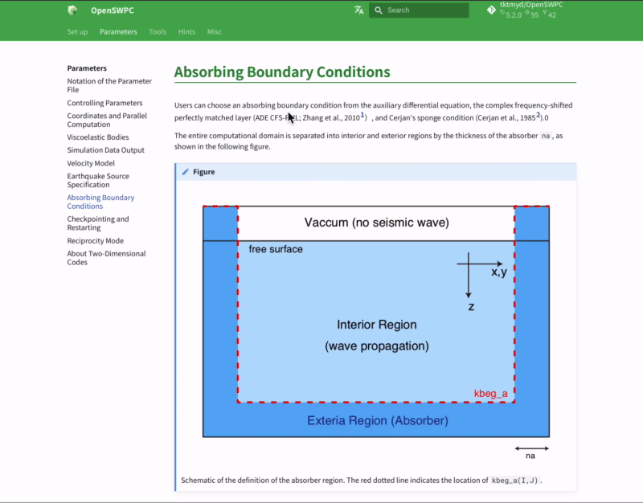

# New features

## Development snapshot

### Better switching between EN/JP documentation

- Now one can switch between Japanese and English documentation using the button to the left of the search box.

- Untranslated documents (for example, this page) are displayed in English even in Japanese mode. 

